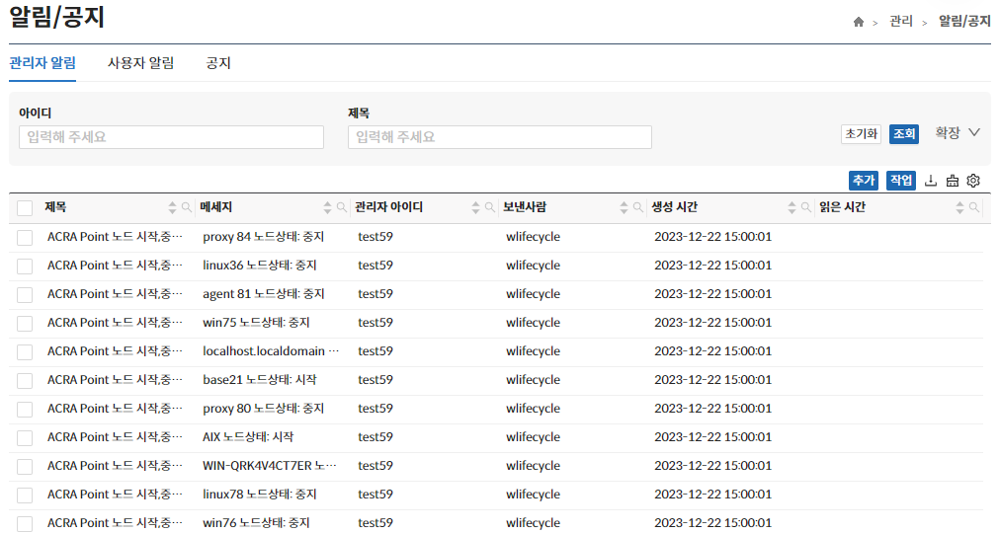
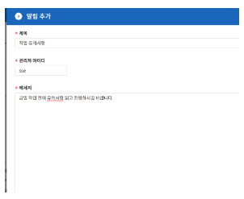
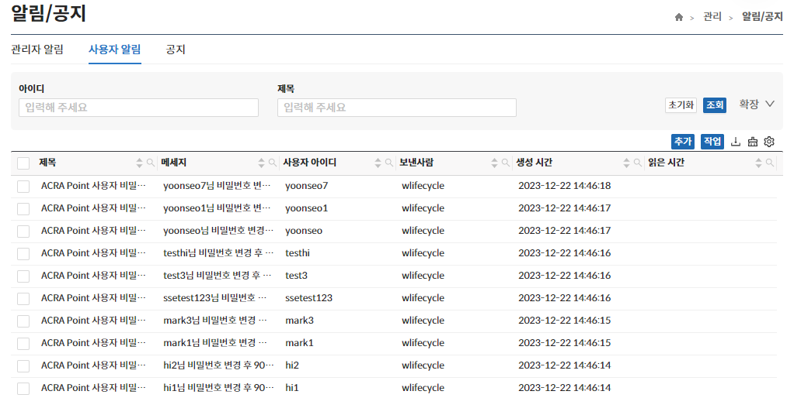
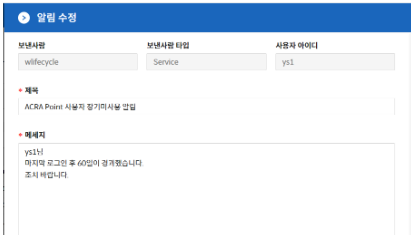
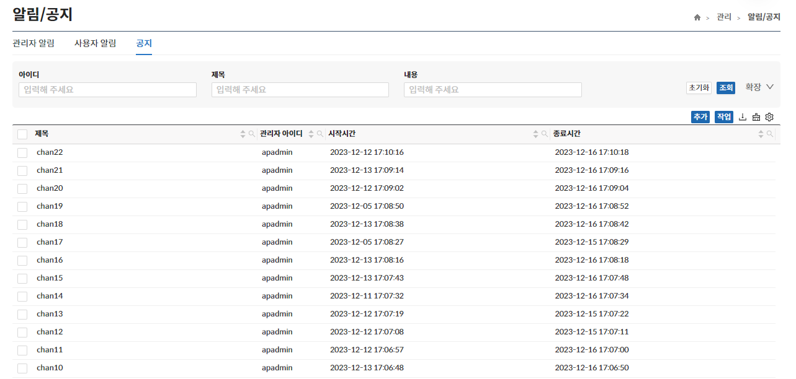
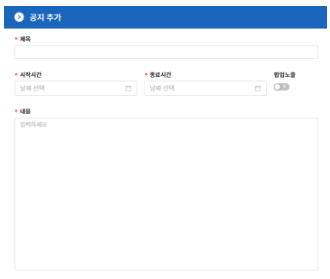

## 알림/공지
해당 메뉴는 엔진 알림 또는 관리자가 전송한 알림을 확인, 추가, 삭제할 수 있는 페이지로 전달받는 대상에 따라 관리자/사용자로 나뉘어 기능을 제공한다.

## 관리자 알림
해당 메뉴는 특정 관리자에게 알림을 보내는 기능으로 해당 페이지에서 **알림 추가, 상세보기, 삭제** 기능을 제공한다.

## 사용자 알림
해당 메뉴는 특정 사용자에게 알림을 보내는 기능으로 해당 페이지에서 **알림 추가, 상세보기, 삭제** 기능을 제공한다.

## 공지
해당 메뉴는 웹 인터페이스에 공지를 보낼 수 있는 기능으로 해당 페이지에서 **공지 추가, 상세보기, 삭제** 기능을 제공한다.

