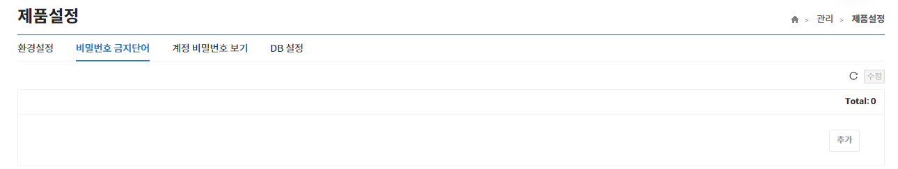

해당 메뉴는 비밀번호에 사용을 금지하는 단어들을 등록하는 기능을 제공한다.

- **+, - 버튼을 이용하여 추가/삭제할 수 있다.**  
- **수정된 내역이 있는 경우에만 “수정”버튼이 활성화된다.**  
- **“수정”버튼을 클릭하지 않고 버튼 클릭 시 현재 수정된 내역이 원상복귀 된다.**  
- **추가된 비밀번호 금지단어는 비밀번호 페이지에서 금지단어 검사를 활성화 해야 검사한다.**  
