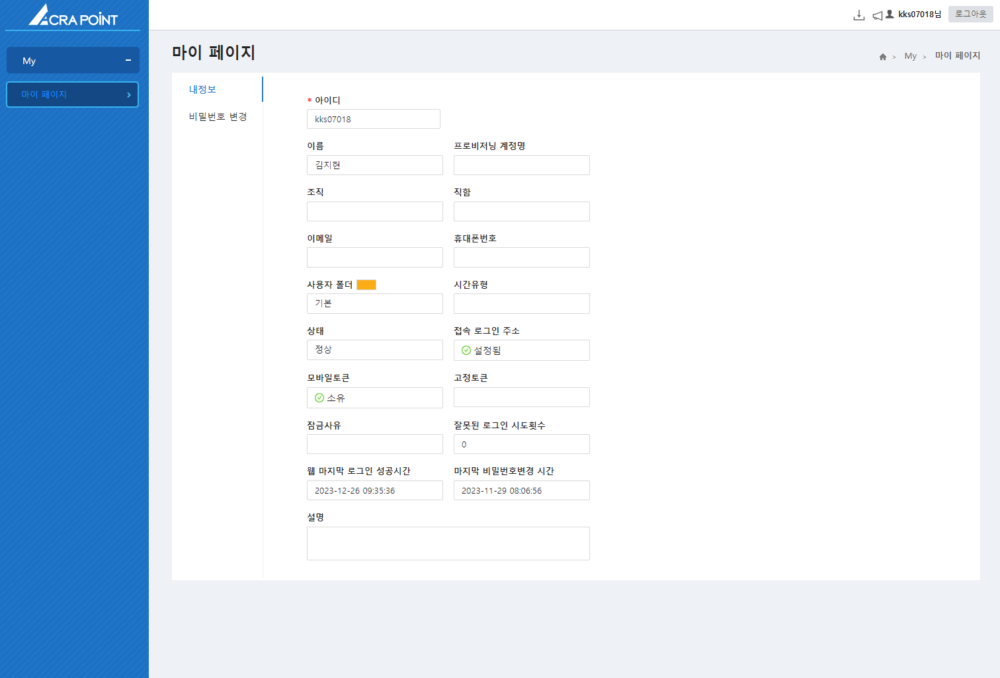

import DownloadSvg from '/static/img/download.svg'
import NoticeSvg from '/static/img/notice.svg'

## 사용자 페이지
해당 메뉴는 사용자가 본인의 정보를 확인할 수 있는 기능을 제공한다.

## 헤더 
 
 
 - <DownloadSvg/> 버튼을 눌러 접속기를 다운로드할 수 있다.
 - <NoticeSvg/> 버튼을 눌러 공지를 확인할 수 있다.

 ## 내정보
해당 메뉴는 로그인한 사용자의 정보를 보여준다.

 ## 비밀번호 변경
 해당 메뉴는 로그인한 사용자의 비밀번호를 변경하는 기능을 제공한다.

