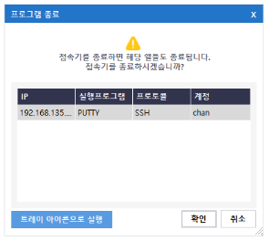
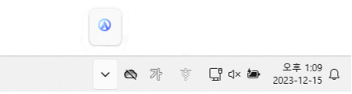

## 프로그램 종료
해당 메뉴는 프로그램 닫기 버튼을 눌렀을 때 실행되는 것으로 확인 버튼을 누르면 접속기 종료에 대한 기능을 제공한다. 

이때 같이 종료되는 프로그램 정보가 출력되며 확인 버튼시에 실행중인 프로그램도 함께 종료된다.

## 트레이 아이콘
해당 메뉴는 프로그램 닫기 버튼을 눌렀을 때 트레이 아이콘으로 실행하는 기능을 지원한다.  
프로그램 닫기 버튼을 누른 후, 트레이 아이콘으로 실행하는 버튼을 누르면 접속기는 종료되지 않고 트레이 아이콘으로 실행된다.

