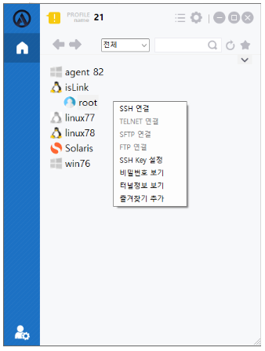

1. SSH 연결 : SSH를 통해 관리대상서버에 연결하는 기능을 제공한다.
2. TELNET 연결 : TALNET 를 통해 관리대상서버에 연결하는 기능을 제공한다.
3. SFTP 연결 : SFTP를 통해 관리대상서버에 연결하는 기능을 제공한다.
4. FTP 연결 : FTP 를 통해 관리대상서버에 연결하는 기능을 제공한다.
5. SSH Key 설정: Key 경로를 설정해 SSH Key를 설정하는 기능을 제공한다.
6. 비밀번호 보기 : ACRA Point에 해당 계정에 비밀번호가 저장이 되어 있고, 정책에 비밀번호 보기가 활성화 되어 있을 경우 해당 계정에 패스워드 보기 조회가 가능하다.  
    *  계정 페이지에서 노드의 비밀번호를 지정할 수 있다.
7. 터널정보 보기 : 해당 계정의 접속 정보를 보여준다.
8. 즐겨찾기 추가/삭제 : 즐겨찾기 리스트에 계정을 추가/삭제 할 수 있는 기능을 제공한다.  
    * 원하는 즐겨찾기 그룹명을 선택하여 완료버튼을 누르면 즐겨찾기 추가를 할 수 있다. 
    * 원하는 즐겨찾기 그룹 탭에 있는 노드를 우클릭 하여 즐겨찾기 삭제를 할 수 있다.
