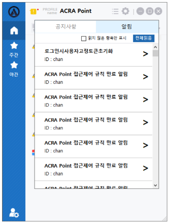

## 공지
해당 메뉴는 접속기 사용자에게 공지사항과 알림을 확인할 수 있는 기능을 제공한다.

## 공지사항
ACRA Point 관리서버에 있는 공지사항을 확인하기 위한 것으로 공지사항 읽기 기능을 제공한다.  
- 공지사항을 클릭했을 때 공지사항에 대한 상세 내용을 확인할 수 있다.

## 알림
ACRA Point 관리서버에서 사용자에게만 전달되는 알림 사항을 확인하기 위한 것으로 알림 사항 읽기 기능을 제공한다.
- 알림을 클릭했을 때 알림에 대한 상세 내용을 확인할 수 있다.
- **전체읽음** 버튼을 클릭해 알림을 모두 읽음 처리할 수 있다.
- `읽지 않은 항목만 표시`를 체크하여 읽지 않은 알림만 확인할 수 있다.

