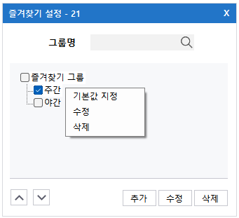
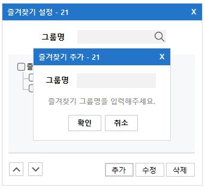
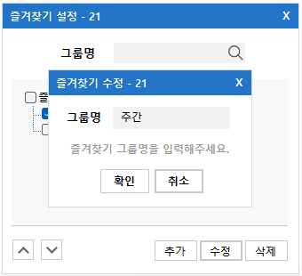
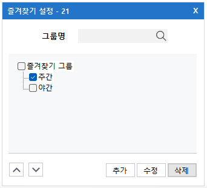
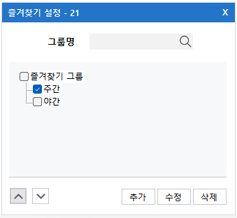
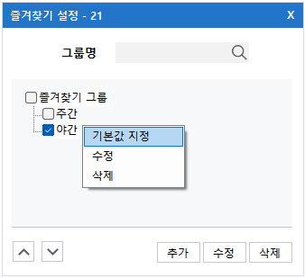
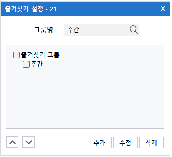

import DownSvg from '/static/img/down.svg';
import UpSvg from '/static/img/up.svg';

## 즐겨찾기 설정
즐겨찾기 그룹 관리 기능을 제공한다.

## 즐겨찾기 그룹 추가
해당 메뉴는 즐겨찾기 그룹을 새롭게 추가하는 기능을 제공한다.  
추가하고자 하는 즐겨찾기 그룹명을 입력하여 **확인** 버튼을 클릭하면 즐겨찾기 그룹을 추가할 수 있다.

## 즐겨찾기 그룹명 수정
해당 메뉴는 즐겨찾기 그룹명을 수정하는 기능을 제공한다.  
수정하고자 하는 즐겨찾기 명을 체크한 후 우클릭하여 **수정** 메뉴를 클릭하거나, **수정** 버튼을 누르면 즐겨찾기 명을 수정할 수 있다.

:::info[정보]
- 즐겨찾기 수정은 한번에 하나씩 수정할 수 있다.
- 그룹명 중복은 불가능하다.
:::

## 즐겨찾기 그룹 삭제
해당 메뉴는 즐겨찾기를 삭제하는 기능을 제공한다.  
삭제하고자 하는 즐겨찾기 그룹을 체크한 후 우클릭하여 **삭제** 메뉴를 클릭하거나, **삭제** 버튼을 누르면 즐겨찾기 그룹을 삭제할 수 있다.                                                                                             

:::tip[팁]
한번에 여러 즐겨찾기 그룹을 선택하여 선택한 즐겨찾기 그룹을 한 번에 삭제할 수 있다.
:::

## 즐겨찾기 그룹 순서 이동
해당 메뉴는 즐겨찾기 순서를 이동하기 위한 것으로 <DownSvg/><UpSvg/> (이하 순서 이동) 버튼을 통해 즐겨찾기 순서를 변경하는 기능을 제공한다.  
순서를 이동하고자 하는 즐겨찾기 명을 체크한 후 **순서 이동** 버튼을 클릭하면 순서를 이동할 수 있다.

:::info[정보]
즐겨찾기 순서이동은 한번에 하나씩 이동할 수 있다.
:::

## 즐겨찾기 그룹 기본값 지정
해당 메뉴는 즐겨찾기에서 기본값으로 설정하기 위한 것으로 즐겨찾기 명을 체크한 후 오른쪽 클릭을 통해 해당 즐겨찾기 명을 기본값으로 설정할 수 있다. 

:::info[정보]
즐겨찾기 기본값은 한번에 하나씩 설정할 수 있다.
:::

## 즐겨찾기 그룹 검색
해당 메뉴는 원하는 즐겨찾기 명을 검색하기 위한 것으로 즐겨찾기 조회 기능을 제공한다.

:::info[정보]
- 검색한 즐겨찾기 명이 존재하지 않거나, 그룹명을 입력하지 않았을 때는 모든 즐겨찾기 그룹이 출력된다.
- 즐겨찾기 그룹 검색 시 대소문자를 구분한다.
:::
