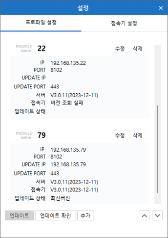

“프로파일 명”, “서버 주소”, “업데이트 서버 주소”, “포트”, “업데이트 포트”, “서버 버전”, “접속기 버전”, “업데이트 상태” 정보를 확인할 수 있다.

- **해당 프로파일을 선택하여 업데이트 확인하거나 업데이트하는 기능을 제공한다.**
- **프로파일에 대한 위치 이동, 추가, 수정, 삭제 기능을 제공한다.**
- **프로파일 수정 시 서버 연결 테스트 기능을 제공한다.**
