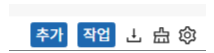

  

공통적으로 사용하는 버튼을 정리하여 기술. 
1. 추가: 해당 페이지의 추가 기능 (페이지에 따라 유무 여부가 다름)
2. 작업: 해당 페이지에서 수행 가능한 작업 리스트
3. 엑셀 다운로드 버튼을 클릭하여 해당 페이지의 데이터를 엑셀로 다운로드
4. 필터초기화 버튼을 클릭하여 프론트 필터 초기화
5. 설정 버튼을 클릭하여 해당 페이지의 컬럼 설정
