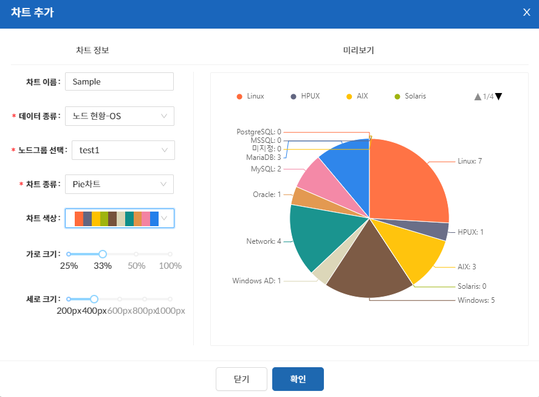

차트 추가는 상단의 편집 버튼을 클릭하여 편집 모드 진입시 “차트 추가” 버튼이 노출되며, 클릭시 차트 추가할 수 있는 모달이 노출된다.

차트의 추가는  
&nbsp; &#45; 차트 이름  
&nbsp; &#45; 표현할 데이터 종류  
&nbsp; &#45; 표현할 노드 그룹(사용자 관련시 사용자역할)  
&nbsp; &#45; 표현할 차트 종류  
&nbsp; &#45; 표현할 차트 색상  
&nbsp; &#45; 화면상 차지할 가로 크기  
&nbsp; &#45; 화면상 차지할 세로 크기

- 차트를 그리는데 반드시 필요한 데이터 종류, 노드그룹 선택, 차트 종류는 필수값이다.
- 데이터 종류에 따라 선택할 수 있는 차트 종류가 변경된다.
- 대상은 노드 그룹으로 선택하므로 표현할 노드들이 해당 노드 그룹에 속해 있어야 한다.
  (사용자 관련된 데이터인 경우 사용자 역할)