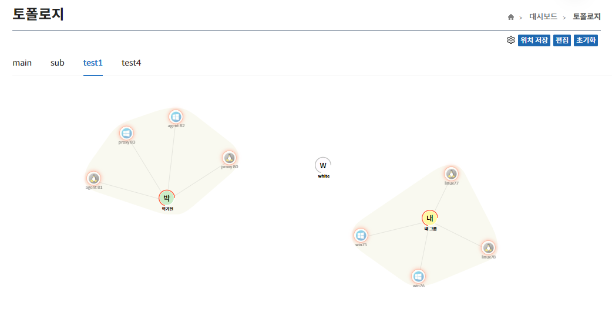
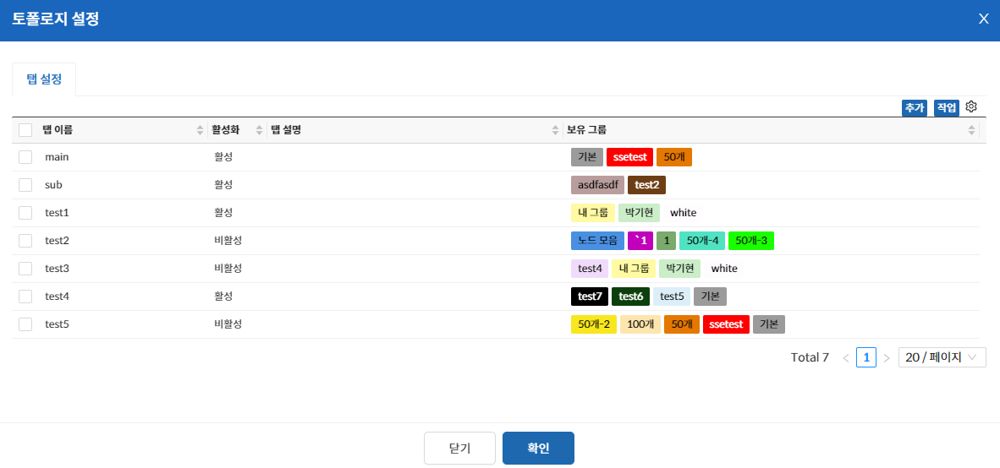
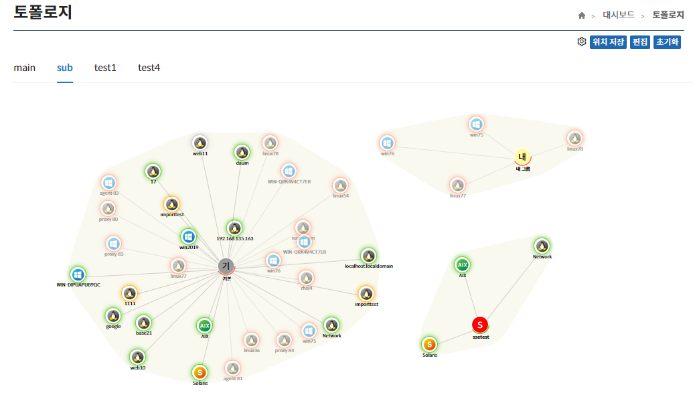
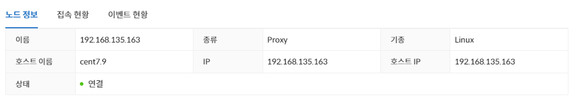

import Tabs from '@theme/Tabs';
import TabItem from '@theme/TabItem';

## 토폴로지

토폴로지 페이지는 관리자가 설정한 토폴로지가 노출되는 페이지로 원하는 보안관리 인터페이스의 관리대상들의 상태를 한 눈에 파악할 수 있고 클릭 시 간략한 정보와 접속 현황, 이벤트 현황을 확인할 수 있다.

## 탭

토폴로지를 사용하려면 우선 탭을 만들어야 한다.
생성한 탭들 중 활성화된 탭들이 토폴로지 화면에 각각 구현된다.

<Tabs>
  <TabItem value="탭 추가" label="탭 추가" default>
    **편집** 버튼을 클릭해 토폴로지 설정으로 진입하고 **추가** 버튼을 클릭하여 탭 추가를 할 수 있다.
    

  :::info[정보]
    - 활성화가 되어 있는 탭만 토폴로지 화면에 노출된다.
    - 탭에 추가되는 데이터는 노드가 아닌 노드 그룹이다.  
      (원하는 노드들이 해당 노드 그룹에 포함되어 있어야 한다.)
  :::

  </TabItem>
  <TabItem value="탭 수정" label="탭 수정">
    **편집** 버튼을 클릭해 토폴로지 설정으로 진입하여 탭 수정을 할 수 있다.

    
탭을 수정할 수 있는 두가지 방법

    1. 원하는 탭의 **Context Menu**(우클릭)에서 상세보기를 통해 탭 수정이 가능하다.
    2. 원하는 탭을 선택해 **작업** 버튼을 클릭하고 상세보기를 통해 탭 수정이 가능하다.

  </TabItem>
  <TabItem value="탭 삭제" label="탭 삭제">
    **편집** 버튼을 클릭해 토폴로지 설정으로 진입하여 탭 삭제를 할 수 있다.

    
탭을 삭제할 수 있는 두가지 방법

    1. 원하는 탭의 **Context Menu**(우클릭)에서 삭제를 통해 탭 삭제가 가능하다.
    2. 원하는 탭을 선택해 **작업** 버튼을 클릭하고 삭제를 통해 탭 삭제가 가능하다.

  </TabItem>
</Tabs>

## 위치 이동 및 스케일 변경

토폴로지에 그려진 아이콘들은 드래그를 통한 위치 이동 및 휠 동작을 통한 스케일 변경이 가능하다.

동일 그룹내의 노드들은 배경에 같은 영역을 통해 알 수 있으며 그룹과의 연결을 통해 해당 그룹에 속해 있음을 한 눈에 알 수 있다.

## 상단 메뉴
 

### 설정
**설정** 버튼은 격자 표시, 센터 표시 활성화 여부를 선택할 수 있는 기능이다.

### 위치 저장
**위치 저장** 버튼은 관리자가 조정한 위치 및 스케일을 저장하는 기능이다.  

### 초기화
**초기화** 버튼은 저장된 위치를 초기화 하는 기능이다.

:::info[정보]
- 위치가 저장되지 않은 경우에 토폴로지 내 이미지들의 첫 위치는 랜덤하게 지정된다.
- dim 처리된 노드는 연결이 끊긴 상태의 노드이다.
:::

## 노드 정보
노드 아이콘을 클릭하면 해당 노드 정보와 접속 현황, 이벤트 현황을 알 수 있다.

<Tabs>
  <TabItem value="노드 정보" label="노드 정보" default>
  노드 이름, 종류, 기종, 호스트 이름, IP, 호스트 IP, 상태 정보를 확인할 수 있다.  
 
  
  </TabItem>
  <TabItem value="접속 현황" label="접속 현황">
  현재 노드의 접속 현황을 확인할 수 있다.  

   

  </TabItem>
  <TabItem value="이벤트 현황" label="이벤트 현황">
  노드의 이벤트 현황을 확인할 수 있다.  

  

  </TabItem>
</Tabs>