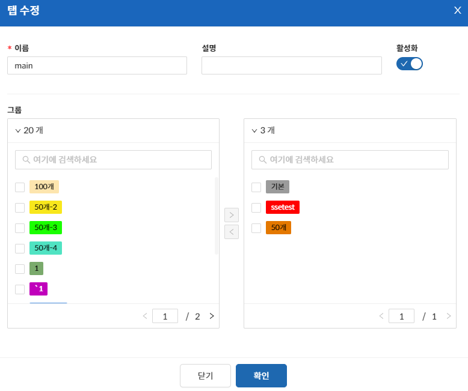

토폴로지를 사용하려면 우선 탭을 만들어야 한다.
생성한 탭들 중 활성화된 탭들이 토폴로지 화면에 각각 구현된다.

&#45; **탭 추가 / 수정 / 삭제**  
우측 상단의 “편집” 버튼을 클릭하면 토폴로지 설정 모달이 노출되고 해당 모달에서 탭을 추가/수정/삭제할 수 있다.

**“추가”** 버튼을 누르면 탭 추가 모달이 노출되며 이름, 설명, 활성화여부, 그룹을 선택하여 탭을 생성할 수 있다.

- 활성화가 되어 있는 탭만 토폴로지 화면에 노출된다.
- 탭에 추가되는 데이터는 노드가 아닌 노드 그룹이다.  
    (원하는 노드들이 해당 노드 그룹에 포함되어 있어야 한다.)

**“편집”** 버튼은 현재 있는 리스트의 Context Menu(우클릭)에서 상세보기를 통해 진입하면 편집 가능하다.  
화면은 추가 화면과 동일하다.

**“삭제”** 버튼은 리스트의 Context Menu에서 삭제를 클릭하거나 원하는 대상을 체크한후 “작업” -> “삭제” 클릭을 통해 가능하다.

