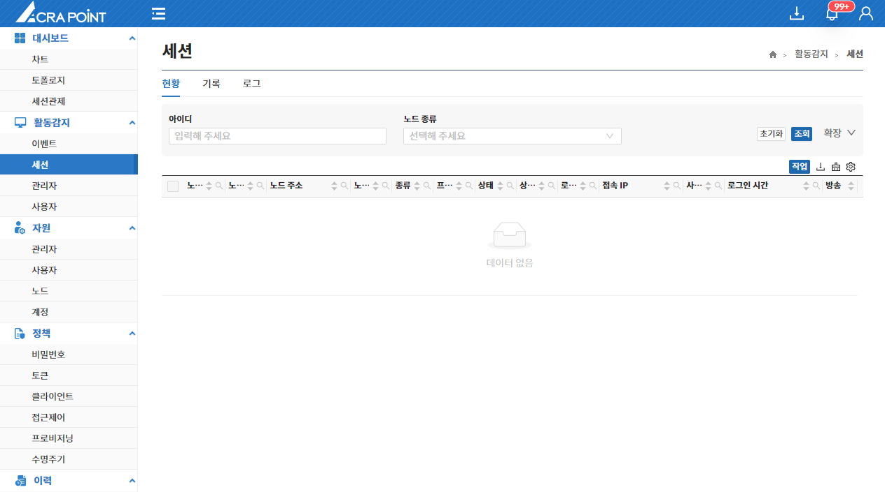

세션현황 보안관리 인터페이스의 관리대상장비에 접속하고 있는 사용자들의 현황을 보기 위한 것으로 세션 차단, 세션 관제 기능을 제공한다.

&#45; **세션 차단**  
원하는 세션을 체크하여 작업 -> 세션 차단 버튼을 클릭하거나 한 개의 세션을 우클릭하여 세션 차단 버튼을 클릭하면 해당 세션에 대한 즉시 차단이 일어난다.

&#45; **세션 관제**  
세션 관제를 클릭하면 라이브 방송 화면으로 이동되며 방송화면에 대한 내용은 [6.2.4 방송페이지](http://localhost:3000/docs/활동감지/6.2%20세션/6.2.4%20방송%20페이지/)에 서술한다.

