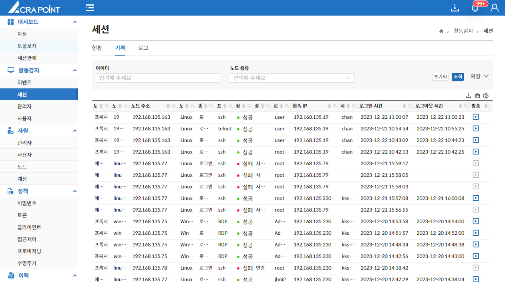

해당 메뉴는 보안관리 인터페이스에 관리대상장비에 접속했던 사용자들의 기록을 보기 위한 것으로 접속기록 조회, 접속기록 보기, 세션 관제 기능을 제공한다.

&#45; **세션 관제**  
세션 관제를 클릭하면 라이브 방송 화면으로 이동되며 방송화면에 대한 내용은 [6.2.4 방송페이지](http://localhost:3000/docs/활동감지/6.2%20세션/6.2.4%20방송%20페이지/)에 서술한다.