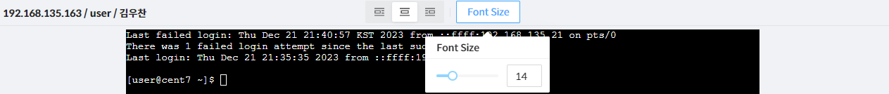

방송 페이지는 보안관리 인터페이스의 대상관리 장비에 접속했던 세션들의 행위를 실시간 또는 녹화된 화면을 볼 수 있는 페이지다.  
해당 페이지는 세션관제, 이벤트, 세션현황, 세션기록 페이지를 통해 진입 가능하다.

  

&#45; **상단 메뉴**  
상단의 좌측에는 접속중인 노드 이름, 로그인 계정, 사용자 이름이 노출된다.  
상단의 중앙에는 위치이동, Font Size 조절(SSH 터미널의 경우), 해상도 조절(RDP의 경우)

&#45; **방송 화면**  
방송 플레이어는 녹화방송인 경우 시작, 정지, 배속 (x1, x2, x4, x8), Progress Bar 점프 기능을 제공하고 실시간인 경우에는 기본 방송과 금지 이벤트 알림이 제공된다. 

&#45; **이벤트 리스트**  
이벤트 리스트는 녹화방송인 경우에만 제공되며 페이지모드, 스크롤 모드로 전환이 가능하다.  
해당 이벤트 클릭 시 해당 이벤트의 시점으로 이동된다.
