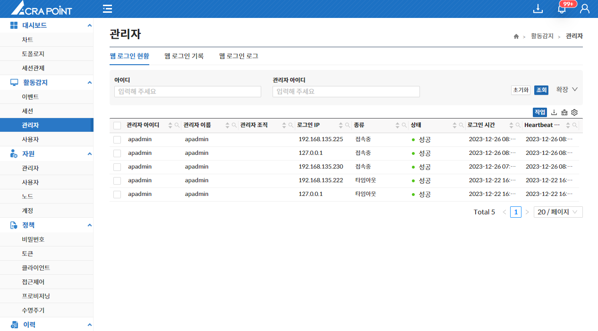
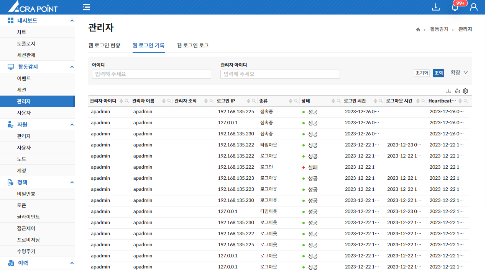
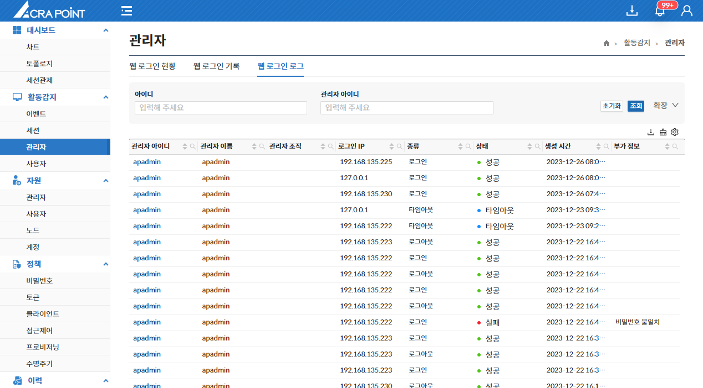

## 웹 로그인 현황
해당 메뉴는 보안관리 인터페이스 웹 콘솔에 로그인한 관리자의 현황을 보기 위한 것으로 세션차단 기능을 제공한다.

:::note[참고]

세션을 차단할 수 있는 두가지 방법

세션 현황에서의 [세션 차단](/docs/활동감지/6.2%20세션/#세션-차단-및-세션-관제)과 동일하다.
:::

## 웹 로그인 기록
해당 메뉴는 보안관리 인터페이스 웹 콘솔에 로그인한 관리자의 로그인 기록을 제공한다.

## 웹 로그인 로그
해당 메뉴는 보안관리 인터페이스 웹 콘솔에 로그인한 관리자의 증적된 로그인 로그를 제공한다.

