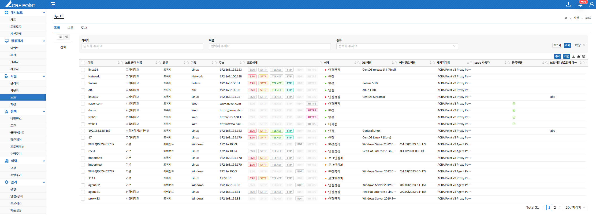
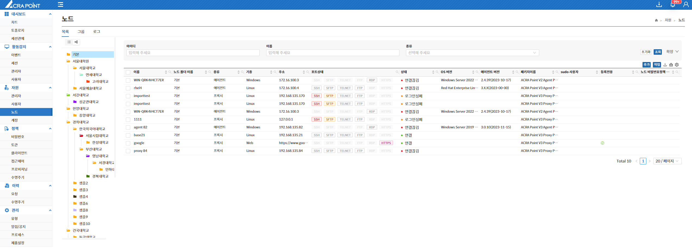
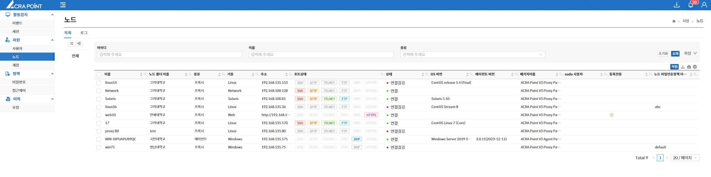
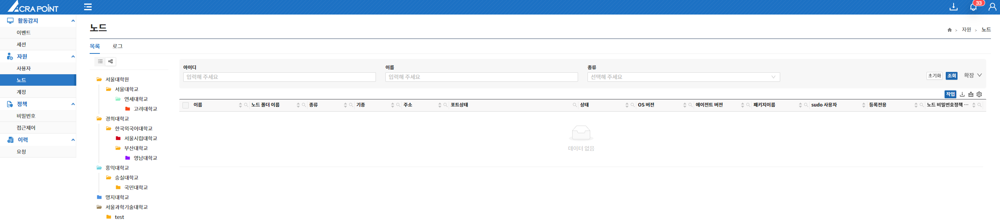
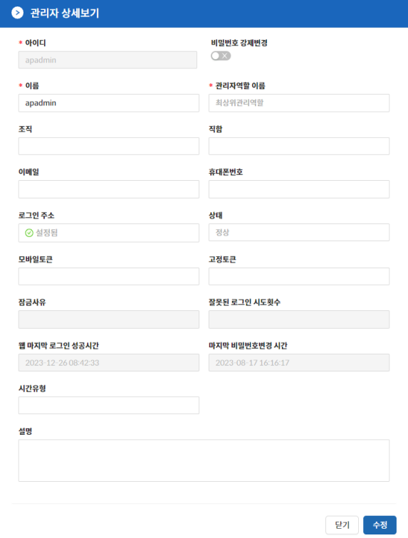

import AdminFeatures from '/src/constant/AdminFeatures';
import Table from '/src/util/Table';
import Tabs from '@theme/Tabs';
import TabItem from '@theme/TabItem';
import Numbering from '/src/util/Numbering';

## 관리자
해당 메뉴는 보안관리 인터페이스에서 ACRA Point 관리서버에 등록된 관리자를 보기 위한 것으로 아래와 같은 기능들을 제공한다.

<Table tableData={AdminFeatures} />  

:::info[정보]
관리폴더 보기 기능은 중간관리역할만 사용 가능하다.
:::  

### 관리자 추가  

**추가** 버튼을 클릭하여 아이디, 이름, 관리자역할 이름, 비밀번호, 비밀번호 확인, 상태를 필수적으로 입력하고 조직, 직함, 이메일, 휴대폰번호, 로그인 주소, 시간유형을 선택적으로 입력해 관리자를 추가할 수 있다.

  

:::warning[주의]
아이디는 중복으로 사용할 수 없다.
:::

:::info[정보]
관리자역할은 최상위관리역할, 중간관리역할이 있다.
:::

## 최상위관리 역할
최상위관리역할 관리자는 모든 메뉴에 대한 정보를 제공받으며, 모든 노드에 대하여 읽고 쓸 수 있는 권한을 가진다.

<Tabs>
  <TabItem value="트리뷰" label="트리뷰" default>
      
  </TabItem>
  <TabItem value="폴더뷰" label="폴더뷰">
  최상위관리역할 관리자는 노드 폴더를 우클릭하여 해당 폴더의 관리자를 지정할 수 있다.

     
  </TabItem>
</Tabs>

:::info[정보]
- 최상위관리역할 관리자는 모든 노드에 대한 노드 폴더를 확인할 수 있다.
- 최상위관리역할 관리자는 모든 노드에 대한 계정 비밀번호 관리대장을 열람할 수 있다.
:::

## 중간관리역할
중간관리역할 관리자는 허가된 특정 메뉴에 대한 정보를 제공받으며, 권한이 할당된 노드에 대하여 읽고 쓸 수 있는 권한을 가진다.

<Tabs>
  <TabItem value="트리뷰" label="트리뷰" default>
      
  </TabItem>
  <TabItem value="폴더뷰" label="폴더뷰">
     
  </TabItem>
</Tabs>

:::info[정보]
  - 중간관리역할 관리자는 권한이 할당된 노드에 대한 이벤트, 세션, 사용자, 노드, 계정, 접근제어 사용자, 접근제어 역할을 확인할 수 있다.
  - 중간관리역할 관리자는 전체 노드의 비밀번호 노드 정책과 접근제어 룰셋을 확인할 수 있다.
  - 중간관리역할 관리자는 관리자 자신이 요청한 이력을 확인할 수 있다.
  - 중간관리역할 관리자는 권한이 할당된 노드에 대한 노드 폴더만 확인할 수 있다.
  - 중간관리역할 관리자는 권한이 할당된 노드에 대한 계정 비밀번호 관리대장을 열람할 수 있다.
:::

## 관리자 수정 유의사항
관리자 추가 이후 수정을 하는 경우에는 상세보기에서 가능한 항목과 불가능한 항목이 나뉘어 있다.  

  

    <Numbering num={1} des='상세보기에서 수정 가능한 항목'/>
    

      <li>이름</li>
      <li>조직</li>
      <li>직함</li>
      <li>이메일</li>
      <li>휴대폰 번호</li>
      <li>설명</li>
    

  

  

    <Numbering num={2} des='상세보기에서 수정 불가능한 항목'/>
    

      <li>비밀번호 변경</li>
      <li>로그인 주소 지정</li>
      <li>잠금/잠금 해제</li>
      <li>모바일 토큰 발급/삭제</li>
      <li>고정 토큰 발급/삭제</li>
      <li>로그인 시간 유형 지정/지정 해제</li>
    

  

 

:::info[정보]
상세보기 진입 시 배경에 Dim 처리된 항목은 수정 불가 항목이다.
:::

:::tip[팁]
상세보기에서 수정 불가능한 항목은 **Context Menu(우클릭)** 또는 **작업** 버튼을 통해 수정할 수 있다.
:::