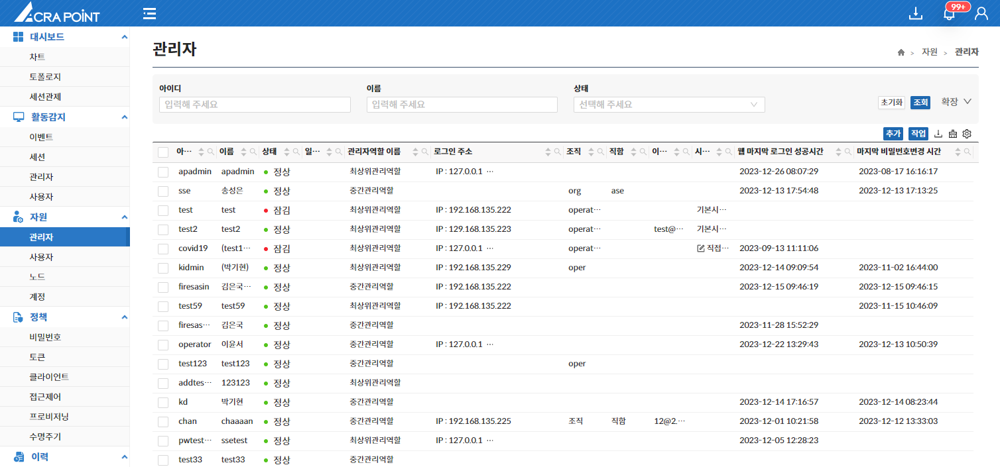
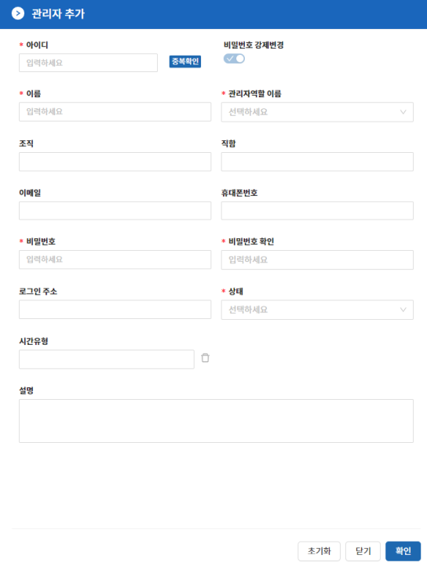

해당 메뉴는 보안관리 인터페이스에서 ACRA Point 관리서버에 등록된 관리자를 보기 위한 것으로 관리자 상세 보기, 관리자 삭제, 비밀번호 변경, 관리자 역할 지정, 로그인주소 지정, 관리폴더 보기, 잠금 및 잠금 해제, 모바일토큰 발급 및 삭제, 고정토큰 발급 및 삭제, 로그인 시간유형 지정 및 지정 해제 기능을 제공한다.

- **관리폴더 보기 기능은 중간관리역할만 사용 가능하다.**

&#45; **관리자 추가**

**“추가”** 버튼은 관리자를 추가할 수 있는 기능으로 아이디, 이름, 관리자역할 이름, 비밀번호, 비밀번호 확인, 상태를 필수적으로 입력하고 조직, 직함, 이메일, 휴대폰번호, 로그인 주소, 시간유형을 선택적으로 입력하여 추가할 수 있다.

- 아이디는 중복으로 사용할 수 없다.
- 관리자역할 이름은 최상위관리역할, 중간관리역할이 있다.
- 관리폴더 지정은 7.3.1 노드 목록의 Folder View에서 가능하다.