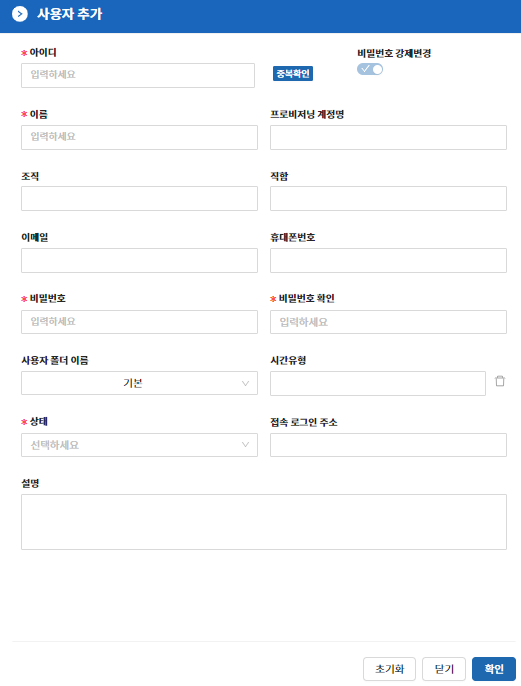
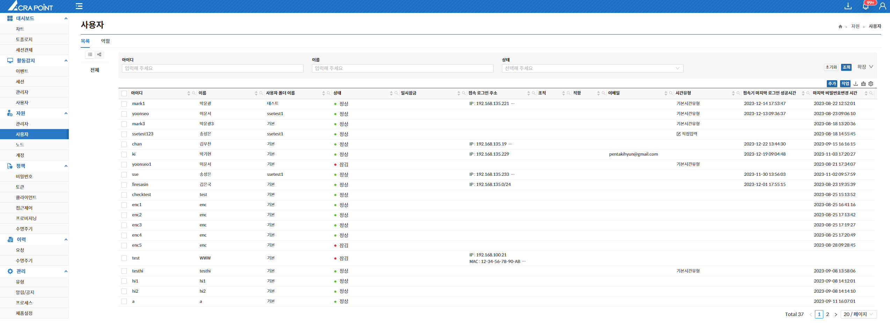
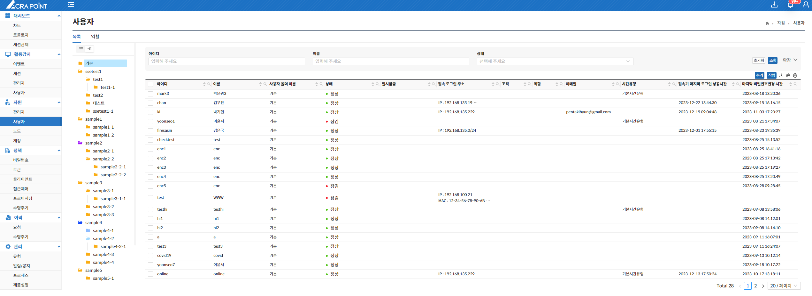
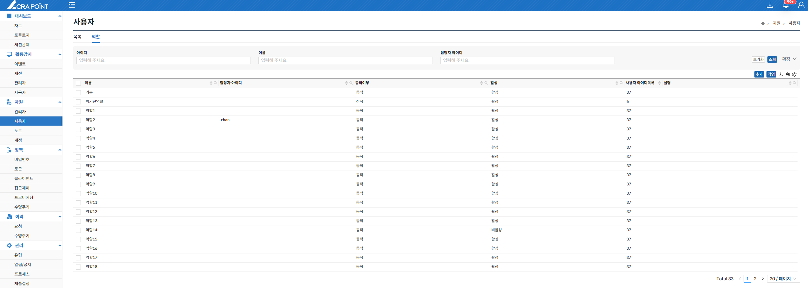
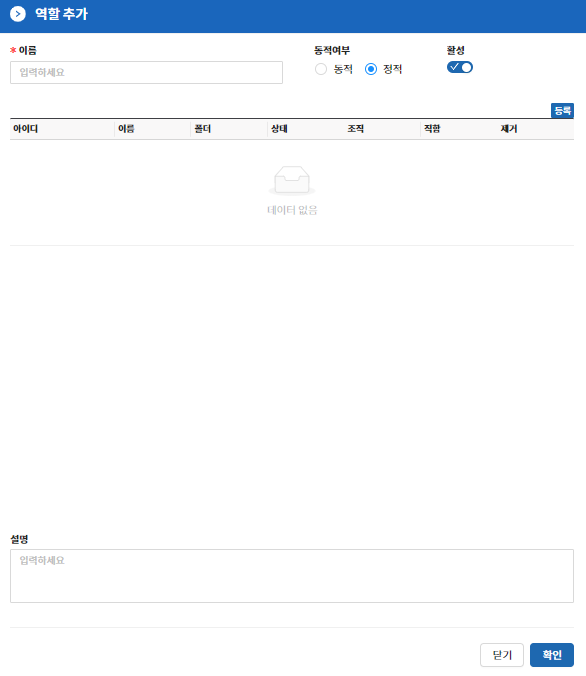
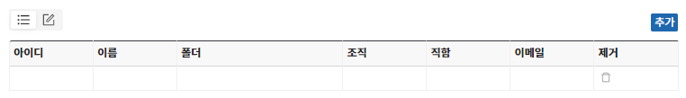
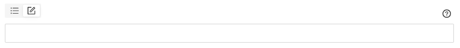
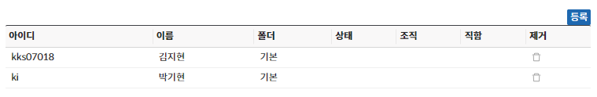

import Table from '/src/util/Table';
import UserListFeatures from '/src/constant/UserListFeatures';
import UserRuleFeatures from '/src/constant/UserRuleFeatures';
import Tabs from '@theme/Tabs';
import TabItem from '@theme/TabItem';
import Numbering from '/src/util/Numbering';

## 사용자

해당 메뉴는 보안관리 인터페이스에서 ACRA Point 관리서버에 등록된 사용자를 보기 위한 것으로 사용자 리스트를 볼 수 있는 목록과 사용자를 그룹핑해 놓을 수 있는 역할을 제공한다.

## 목록

목록 탭은 보안관리 인터페이스에서 ACRA Point 관리서버에 등록된 사용자를 보기 위한 것으로 `List View`와 `Folder View`를 지원하며 아래와 같은 기능들을 제공한다.

<Table tableData={UserListFeatures} />

### 사용자 추가

**추가** 버튼을 클릭하여 아이디, 이름, 비밀번호, 비밀번호 확인, 상태를 필수적으로 입력하고 조직, 직함, 이메일, 휴대폰번호, 사용자 폴더 이름, 시간유형, 접속 로그인 주소를 선택적으로 입력해 사용자를 추가할 수 있다.

:::warning[주의]
아이디는 중복으로 사용할 수 없다.
:::

### 폴더의 생성/수정/삭제

폴더의 생성/수정/삭제는 기본적으로 폴더영역에서 우클릭을 통해 동작 가능하다.

<Tabs>
  <TabItem value="트리뷰" label="트리뷰" default>
      
  </TabItem>
  <TabItem value="폴더뷰" label="폴더뷰">
   

  :::info[정보]
  - 폴더 영역의 빈공간을 우클릭하여 생성하는 경우 root path의 폴더가 생성된다.
  - 폴더를 우클릭하여 생성하는 경우 클릭한 폴더의 하위 폴더가 생성된다.
  - 폴더 수정은 폴더명 수정과 색상 수정 메뉴로 나뉘어 있다.
  - 폴더를 삭제한 경우 해당 폴더에 속한 사용자는 기본 폴더로 이동된다.
  - 상위 폴더를 삭제한 경우 하위 폴더도 함께 삭제된다.
  - 기본 폴더는 삭제가 불가능하다.
  :::
  </TabItem>
</Tabs>

### 폴더에 사용자 지정

폴더에 사용자를 지정하는 세가지 방법

1. **Context Menu**에서 폴더 지정하여 한 명의 사용자를 폴더에 지정할 수 있다.
2. 사용자를 드래그하여 목표 폴더에 드랍하여 폴더에 사용자를 지정할 수 있다.
3. 사용자를 체크하고 **작업** 버튼을 클릭하여 폴더에 사용자를 지정할 수 있다.

:::tip[팁]
사용자를 다중 체크하고 드래그를 하거나 **작업** 버튼을 클릭하여 폴더에 다중 사용자를 지정할 수 있다.
:::

## 역할

역할 탭은 보안관리 인터페이스에서 ACRA Point 관리서버에 등록된 사용자 역할을 보기 위한 것으로 아래와 같은 기능들을 제공한다.

<Table tableData={UserRuleFeatures} />

### 사용자 역할이란?

ACRA Point 관리서버에 등록된 사용자 개체들을 묶어 놓은 객체이며, 동적 또는 정적으로 할당할 수 있다.

### 사용자 역할 추가

**추가** 버튼을 클릭하여 이름, 동적/정적할당 여부, 활성 여부를 필수적으로 입력해 사용자 역할을 추가할 수 있다.

#### 사용자 역할의 동적 여부

사용자 역할은 동적과 정적을 지원한다.

<Tabs>
  <TabItem value="동적" label="동적" default>
  동적은 원하는 사용자의 조건을 설정하여 조건에 맞는 사용자를 역할로 등록하는 것이다.

#### 동적이 지원하는 두가지 UX

<Numbering num={1} des='List Mode'/>
  아이디, 이름, 폴더, 조직, 직함, 이메일 항목에 원하는 조건을 넣어 조합할 수 있다.

- 폴더 항목의 경우 사용자 폴더를 선택할 수 있다.

<Numbering num={2} des='Input Mode'/>
  보다 전문적인 모드로 원하는 구문을 넣어 지정할 수 있다.

:::note[예시]

Input Mode 구문 예시

  - IP가 x.x.x.x인 사용자  
  `EasyAccessAddresses.IPAddress like "x.x.x.x"`

  - Name이 abc이고 Age가 40인 사용자  
    `Name = "abc" and Age=40`

  - ID를 가진 모든 사용자  
    `ID like "*"`
:::

:::tip[팁]
`Input Mode`의 우측에 위치한 **구문 도움말** 아이콘을 클릭해 **규칙**, **예시**, **샘플**을 확인할 수 있다.
:::
  </TabItem>
  <TabItem value="정적" label="정적">
  정적은 원하는 사용자를 선택하여 역할로 등록하는 것이다.

  #### 정적으로 사용자를 추가하는 방법
  1. **등록** 버튼을 클릭한다.
  2. 추가할 사용자를 선택하고 **확인** 버튼을 클릭한다.

  

  :::info[정보]
  정적으로 사용자를 추가하면 자동으로 아이디, 이름, 폴더가 입력된다.
  :::

  </TabItem>
</Tabs>
