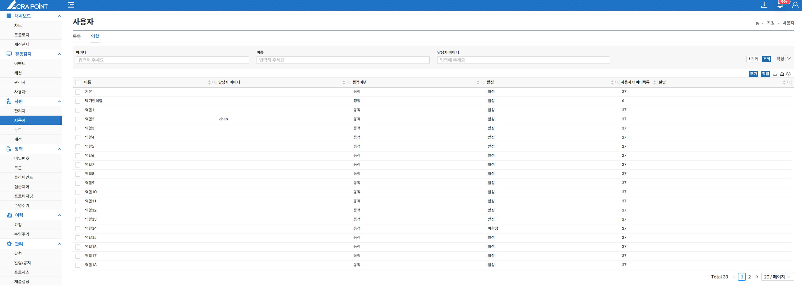
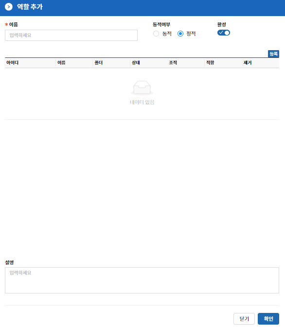

역할 탭은 보안관리 인터페이스에서 ACRA Point 관리서버에 등록된 사용자 역할을 보기 위한 것으로 상세보기, 사용자 역할 삭제, 멤버 보기, 접근 가능한 계정 보기, 담당자 지정 및 지정 해제 기능을 제공한다.  

사용자 역할이란, ACRA Point 관리서버에 등록된 사용자 개체들을 묶어 놓은 객체이며, 동적 또는 정적으로 할당할 수 있다.

&#45; **사용자 역할 추가**
**“추가”** 버튼은 역할을 추가할 수 있는 기능으로 이름, 동적할당/정적할당 여부, 활성여부를 설정하여 추가할 수 있다.

&#45; **동적과 정적**
사용자 역할은 동적과 정적을 지원하며 동적에서는 두가지의 UX를 지원한다.  

- **정적은 원하는 사용자를 선택하여 역할로 등록하는 것이다.**  
- **동적은 원하는 사용자의 조건을 설정하여 조건에 맞는 사용자를 역할로 등록하는 것이다.**  
- **동적의 리스트 모드는 아이디, 이름, 팀, 직함, 이메일 항목에 원하는 조건을 넣어 조합할 수 있다.**  
- **동적의 Input 모드는 보다 전문적인 모드로 원하는 구문을 넣어 지정할 수 있다.**  
