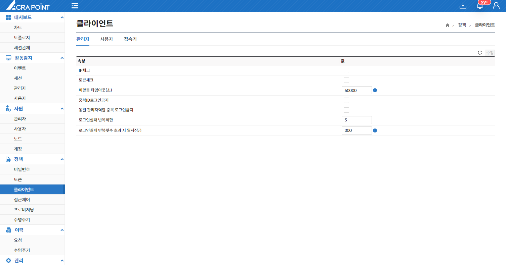
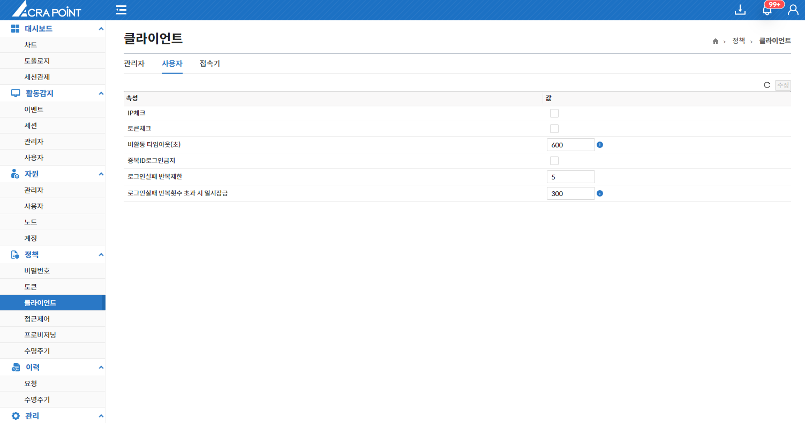
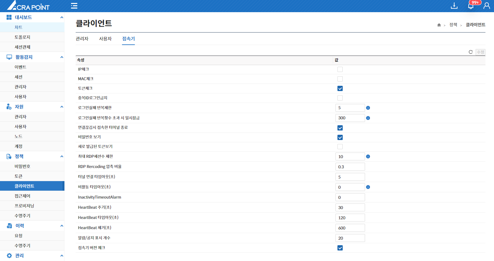

## 관리자

해당 메뉴는 보안관리 인터페이스에 ACRA Point에서 관리서버에 등록된 관리자 로그인 정책을 보기 위한 것으로 수정 가능하다.

:::info[정보]
시간값, 제한 횟수에서 0은 검사하지 않음을 의미한다.
:::

## 사용자
해당 메뉴는 보안관리 인터페이스에 ACRA Point에서 관리서버에 등록된 사용자 로그인 정책을 보기 위한 것으로 수정 가능하다.

:::info[정보]
시간값, 제한 횟수에서 0은 검사하지 않음을 의미한다.
:::

## 접속기
해당 메뉴는 보안관리 인터페이스에 ACRA Point에서 관리서버에 등록된 접속기 로그인 정책을 보기 위한 것으로 수정 가능하다.

:::info[정보]
시간값, 제한 횟수에서 0은 검사하지 않음을 의미한다.
:::