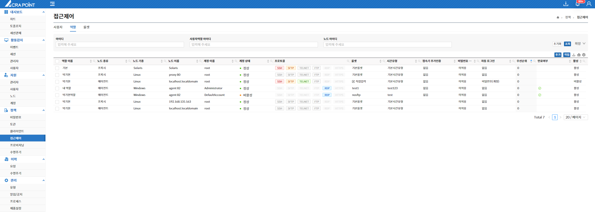
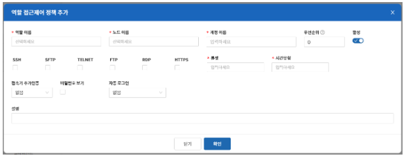

해당 메뉴는 보안관리 인터페이스에서 ACRA Point 관리서버에 등록된 역할 접근제어 정책을 보기 위한 것으로 역할 접근제어 정책 삭제 기능을 제공한다.

역할 접근제어 정책이란, 역할이 ACRA Point 관리서버에 등록된 노드에 접근하기 위한 정책이며 다양한 역할을 할 수 있는 어떤 사용자들이 어떤 노드에 어떤 계정으로 접근할 것인지에 대한 정책을 설정하는 것이다.

&#45; **역할 접근제어 정책 추가**  
해당 사용자역할에 속한 사용자들이 어떤 노드에 어떤 계정으로 접근을 할 수 있고 어떠한 규칙을 설정하는지를 생성한다.

 **우선순위, 룰셋, 시간유형, 접속기 추가인증, 비밀번호 보기, 자동 로그인은 [8.4.1 사용자 접근제어](http://localhost:3000/docs/정책/8.4%20접근제어/8.4.1%20사용자/) 정책 추가 기능과 동일하다**