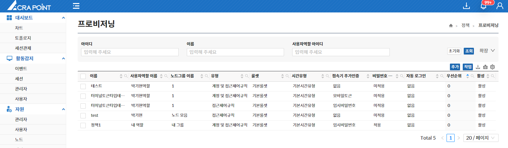
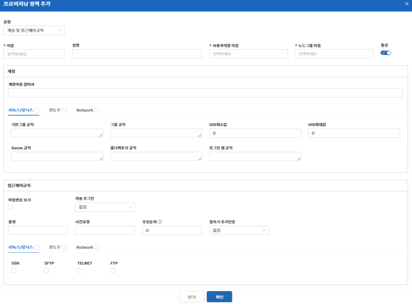

해당 메뉴는 보안관리 인터페이스에서 ACRA Point 관리서버에 등록된 프로비저닝 정책을 보기 위한 것으로 프로비저닝 **정책 추가/수정/삭제** 기능을 제공한다.

:::info[정보]
ACRA Point에서 지원하는 **프로비저닝 정책**은 사용자 등록 시 해당 정책의 조건에 따라 사용자 OS 계정을 생성하는 기능이다.
:::

### 프로비저닝 정책 추가
**추가** 버튼은 프로비저닝 정책을 추가할 수 있는 기능으로 `유형`, `이름`, `사용자역할 이름`, `노드그룹 이름`, `활성 여부`를 필수적으로 입력하고 `계정`, `접근제어규칙`을 선택적으로 입력하여 추가할 수 있다.

- `유형`은 `계정 및 접근제어규칙`과 `접근제어규칙`이 있다.
- `계정`은 `계정이름 접미사`를 설정할 수 있고, 운영체제에 따라 `규칙`을 설정할 수 있다.
- `접근제어규칙`은 `비밀번호 보기`, `자동 로그인`, `룰셋`, 시간유형, `우선순위`, `접속기 추가 인증`을 설정할 수 있고, 운영체제에 따라 `연결`을 설정할 수 있다.

:::note[참고]
`우선순위`, `룰셋`, `시간유형`, `접속기 추가인증`, `비밀번호 보기`, `자동 로그인`은 [8.4 사용자 접근제어](/docs/정책/8.4%20접근제어/#사용자) 정책 추가 기능과 동일하다.
:::