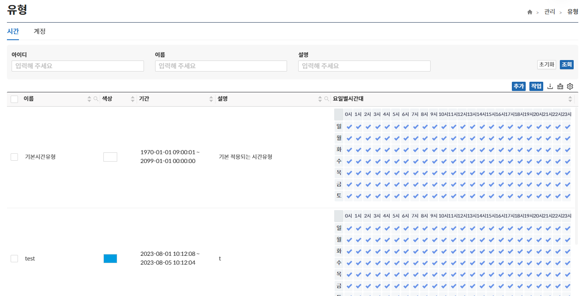
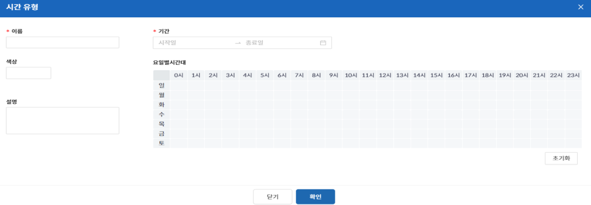
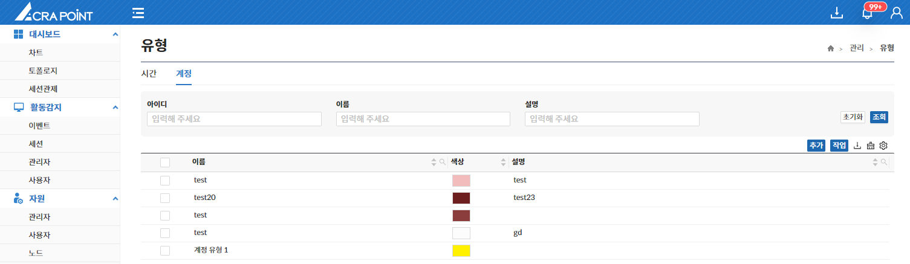
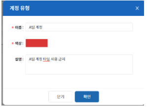

## 유형
해당 메뉴는 보안관리 인터페이스에서 사용되는 여러 유형의 **추가, 삭제, 수정** 기능을 제공한다.

## 시간 유형
해당 메뉴는 정책, 수명주기 등 여러 항목 등에서 사용되는 시간 유형 값의 **추가/수정/삭제** 기능을 제공한다.

:::tip[팁]
`Ctrl` 버튼을 누르고 클릭하면 **다중 선택**이 가능하다.
:::

## 계정 유형
해당 메뉴는 계정에 적용하는 라벨링 기능으로 해당 페이지에서 **추가/수정/삭제** 기능을 제공한다.

