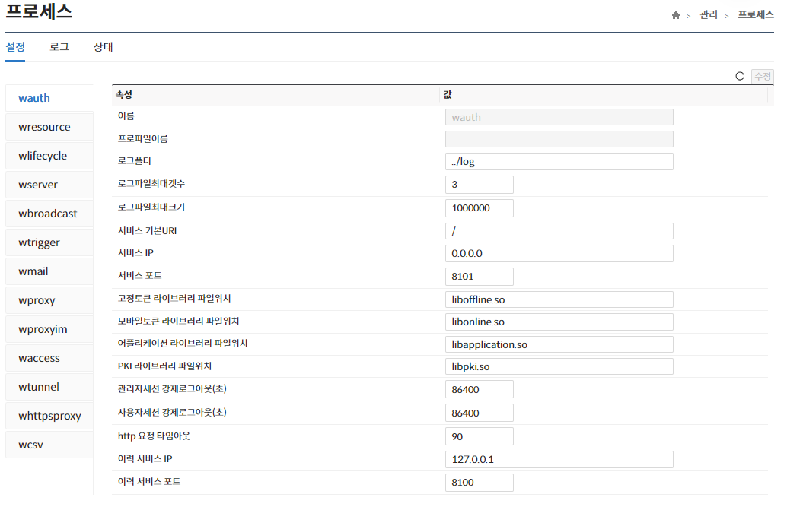

import RefreshSvg from '/static/img/refresh.svg'

## 프로세스
해당 메뉴는 관리서버에서 실행중인 프로세스에 관련된 페이지로 설정, 로그, 상태 페이지를 제공한다.

## 설정
해당 메뉴는 관리서버에서 실행중인 프로세스에 대한 설정값을 **확인/수정** 기능을 제공한다.

:::info[정보]
- 수정된 내역이 있는 경우에만 **수정 버튼**이 활성화된다.
- **수정 버튼**을 클릭하지 않고 <RefreshSvg/> 버튼 클릭 시 현재 수정된 내역이 원상복귀 된다. 
- 프로파일이 있는 프로세스의 경우 프로파일 **선택/추가**가 가능하다.
:::

## 로그
해당 메뉴는 프로세스의 증적된 로그를 제공한다.

## 상태
해당 메뉴는 프로세스의 현재 상태와 무결성 검사 기능을 제공한다.

