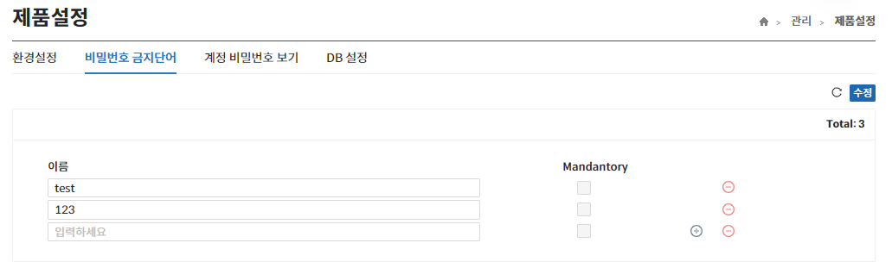
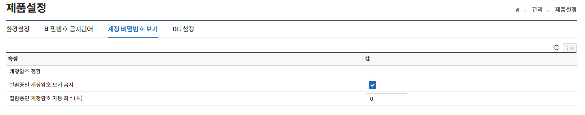

import RefreshSvg from '/static/img/refresh.svg'

## 제품설정
해당 메뉴는 제품의 각종 설정값을 확인/설정하는 기능을 제공한다.

## 환경설정
해당 메뉴는 제품의 전반적인 환경설정 값의 **확인/설정** 기능을 제공한다.

- 에이전트 설치 전 등록필수 체크가 되어 있으면 노드 추가 시 에이전트도 추가가 가능하다.
  (미 체크 시 프록시만 추가 가능)
- 프로토콜 및 DB별 기본포트 값은 노드 추가 시 기본 적용되는 값이다.
- 수정된 내역이 있는 경우에만 **수정** 버튼이 활성화된다.  
- **수정** 버튼을 클릭하지 않고 <RefreshSvg/> 버튼 클릭 시 현재 수정된 내역이 원상복귀 된다.

## 비밀번호 금지단어
해당 메뉴는 비밀번호에 사용을 금지하는 단어들을 **등록**하는 기능을 제공한다.

- +, - 버튼을 이용하여 **추가/삭제**할 수 있다.
- 수정된 내역이 있는 경우에만 **수정** 버튼이 활성화된다.  
- **수정** 버튼을 클릭하지 않고 <RefreshSvg/> 버튼 클릭 시 현재 수정된 내역이 원상복귀 된다.
- 추가된 비밀번호 금지단어는 비밀번호 페이지에서 `금지단어 검사`를 `활성화` 해야 검사한다.

## 계정 비밀번호 보기
해당 메뉴는 계정 비밀번호 보기와 관련된 정보를 **확인/수정** 기능을 제공한다.

- 수정된 내역이 있는 경우에만 **수정** 버튼이 활성화된다.  
- **수정** 버튼을 클릭하지 않고 <RefreshSvg/> 버튼 클릭 시 현재 수정된 내역이 원상복귀 된다. 
- `계정암호 전환`은 계정 암호를 열람한 경우 자동으로 암호 변경되는 기능이다.

## DB 설정
해당 메뉴는 관리 인터페이스의 DB에 대한 설정을 **확인/수정** 기능을 제공한다.

- 수정된 내역이 있는 경우에만 **수정** 버튼이 활성화된다.  
- **수정** 버튼을 클릭하지 않고 <RefreshSvg/> 버튼 클릭 시 현재 수정된 내역이 원상복귀 된다.
- 항목 수정 시 모든 항목은 필수값이다.
