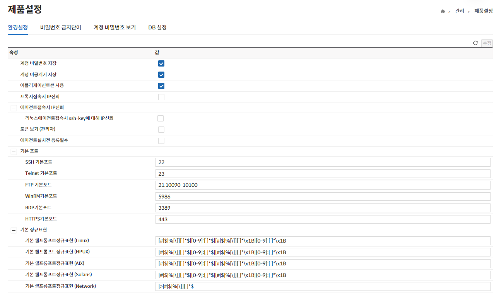

해당 메뉴는 제품의 전반적인 환경설정 값을 확인/설정하는 기능을 제공한다.

- **에이전트 설치 전 등록필수 체크가 되어 있으면 노드 추가 시 에이전트도 추가가 가능하다.**  
  **(미 체크 시 프록시만 추가 가능)**
- **프로토콜 및 DB별 기본포트 값은 노드 추가 시 기본 적용되는 값이다.**  
- **수정된 내역이 있는 경우에만 “수정”버튼이 활성화된다.**  
- **“수정”버튼을 클릭하지 않고 버튼 클릭 시 현재 수정된 내역이 원상복귀 된다.**  