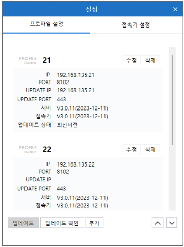
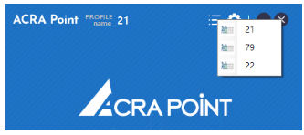

## 프로파일
ACRA Point 관리서버를 프로파일 명, 서버 IP, Port 정보 등을 입력해 프로파일 등록이 가능하다.
 

:::info[정보]
더 많은 프로파일에 대한 설명은 [12.9 프로파일 설정](/docs/접속기/12.9%20프로파일%20설정/)에서 확인할 수 있다.
:::

### 프로파일 전환
프로파일이 2개 이상 존재 시, 상단에 프로파일 메뉴를 클릭하여 프로파일 전환이 가능하다.

