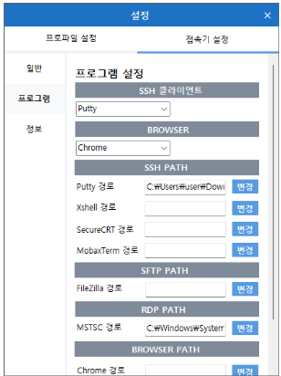

import Table from '/src/util/Table'
import ClientConnectProgram from '/src/constant/ClientConnectProgram'

## 접속기 설정
해당 메뉴는 접속기에 대한 설정을 확인하기 위한 것으로 접속기 설정 기능을 제공한다.

## 일반
로그인과 로그 레벨을 확인하기 위한 것으로 로그 레벨 설정 기능을 제공한다.

- 로그인은 윈도우 시작 시 자동 실행 항목의 체크 여부에 따라 접속기가 실행한다.
- 로그 레벨은 ERROR, DEBUG, INFORMATION 중 하나를 선택할 수 있다.

## 연결 프로그램
해당 메뉴는 계정에 접속할 때 사용하는 프로그램을 확인하기 위한 것으로 프로그램 설정 기능을 제공한다.

<Table tableData={ClientConnectProgram}/>

:::info[정보]
SFTP인 경우 관리 콘솔에서 SFTP 포트를 명시해야 자동 접속이 가능하다.
:::

## 정보
해당 메뉴는 접속기 정보를 확인하기 위한 것으로 제품명, 릴리즈 버전, 제작회사, 패치 이력에 대한 정보를 제공한다.

