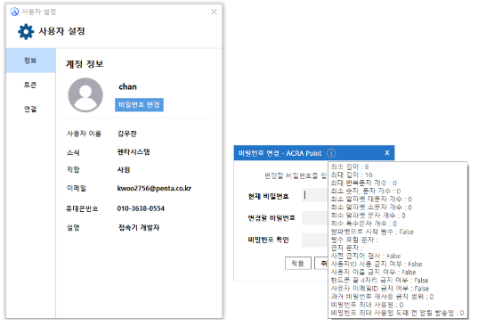
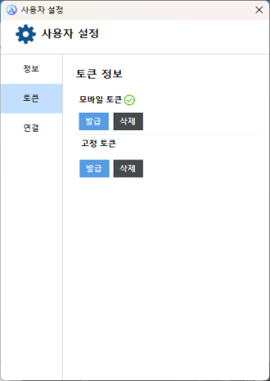
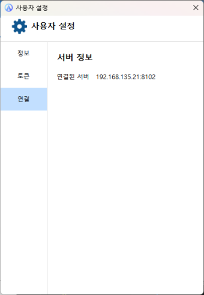

import UserSettingSvg from '/static/img/userSetting.svg'
import InfoSvg from '/static/img/info.svg'

## 사용자 설정
해당 메뉴는 사용자에 대한 설정을 확인하기 위한 것으로 사용자 설정 기능을 제공한다.  
접속기 좌측 하단의 <UserSettingSvg/> 버튼을 클릭해 사용자 설정 창을 열 수 있다.

## 계정
사용자 정보를 확인하기 위한 것으로 사용자 이름, 조직, 직함, 이메일, 휴대폰 번호, 설명을 확인할 수 있다. 

현재 로그인한 계정의 비밀번호 변경 기능을 제공하며, 현재 비밀번호, 변경할 비밀번호, 비밀번호 확인까지 입력한 뒤 **적용** 버튼을 클릭하여 비밀번호를 변경할 수 있다.

:::info[정보]
비밀번호 규칙은 상단의 <InfoSvg/> 아이콘을 통해 확인할 수 있다.
:::

## 토큰
모바일 토큰과 고정 토큰에 대한 설정을 하기 위한 것으로 발급, 삭제 요청 기능을 제공한다.

## 연결
해당 메뉴는 현재 연결된 관리서버 정보를 확인하기 위한 것으로 연결된 관리서버의 IP, Port 정보를 제공한다.

