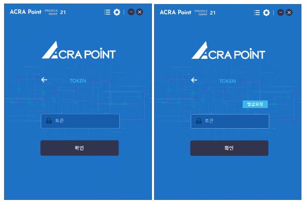
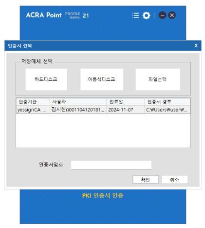

정책에 따라 2factor 인증을 하며 TOKEN로그인은 오프라인 토큰, 온라인(구글 OTP) 토큰중 정책에 선택된 TOKEN으로 인증을 해야 한다.

접속기 토큰 타입으로는 모바일토큰, 고정토큰, PKI를 사용할 수 있다.

&#45; **모바일 / 고정 토큰**  
해당 화면은 발급받은 모바일 / 고정 토큰을 입력하여 토큰 인증을 통한 로그인 기능을 제공한다. 

- **고정 토큰은 토큰 발급 요청을 할 수 있다.**

&#45; **PKI**  
해당 화면은 저장매체에서 선택한 인증서의 암호를 입력하여 PKI 인증서 인증을 통한 로그인 기능을 제공한다.

- **저장매체로 하드디스크(C, D), 이동식디스크, 파일 선택을 지원한다.**  
- **접속기에서 인증서를 탐지할 시 GPKI, NPKI 경로를 모두 검사한다.**
