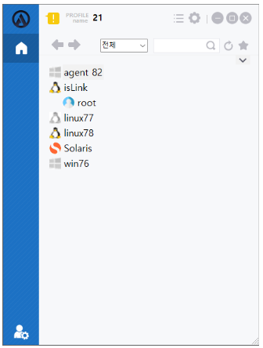
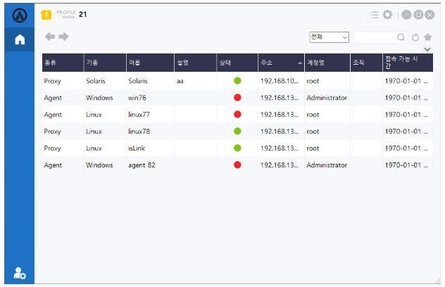
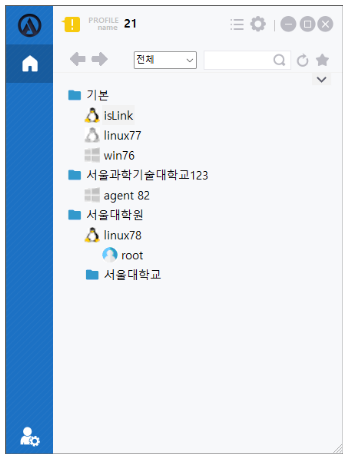
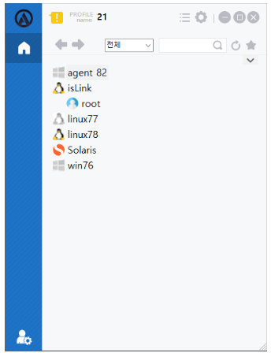
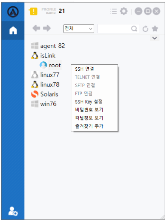

## 기본(홈)
해당 화면은 ACRA Point 관리서버가 해당 접속기 사용자에게 할당한 모든 노드 정보를 확인할 수 있는 기능을 제공한다.

## 기본 보기
노드와 계정에 대한 정보를 보여주는 화면으로, `Tree View`를 지원한다.

- 부모 트리는 서버, 자식 트리는 계정으로 구성되어 있다.
- 노드 표시 방법으로 노드의 이름, 주소, 자산 이름, 구성 이름, 설명을 사용할 수 있다.

## 테이블 보기
계정에 대한 모든 정보를 보여주는 화면으로, `Grid View`를 지원한다.  
각 노드에 대한 모든 계정 정보를 확인할 수 있다.  

- 각 컬럼에 대해 표시 여부를 선택할 수 있다.
- 계정에 대한 노드의 종류, 기종, 이름, 설명, 상태, 주소, 계정명, 조직, 접속 가능 시간 으로 구성되어 있다.

## 폴더 보기
노드와 계정에 대한 정보를 보여주는 화면으로, `Folder View`를 지원한다.

- 부모 트리는 서버, 자식 트리는 계정으로 구성되어 있다.
- 노드 표시 방법으로 노드의 이름, 주소, 자산 이름, 구성 이름, 설명을 사용할 수 있다.

## 노드
접속한 사용자가 접근 가능한 서버 정보를 제공한다.  
일반 사용자 모드인 경우 노드에 마우스 hover 시 서버 요약 정보가 표시된다.

## 계정
접속한 사용자가 접근 가능한 서버에 대한 계정 정보를 제공한다.  
해당 계정을 **더블 클릭**하거나 **우클릭 메뉴**를 통해 관리 대상 서버로 연결하거나 정책에 따라 비밀번호 보기, 터널 정보보기를 지원한다.

