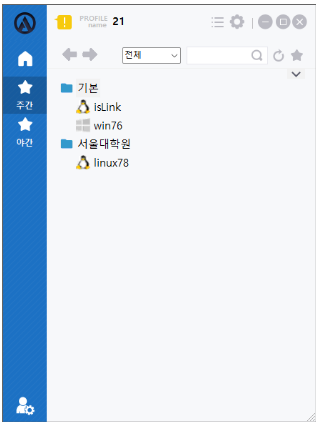

## 즐겨찾기
해당 화면은 ACRA Point 관리서버가 해당 접속기 사용자에게 할당한 모든 노드 중 사용자가 즐겨찾기에 등록한 노드의 계정들만 확인할 수 있도록 하는 기능을 제공한다.

## 기본 보기
사용자가 즐겨찾기에 추가한 계정에 대한 정보를 보여주는 화면으로 `Tree View`를 지원한다.  

- 운영체제 및 상태는 아이콘으로, 노드 이름, 노드 주소, 계정명으로 구성되어 있다.

## 그리드 보기
사용자가 즐겨찾기에 추가한 계정에 대한 모든 정보를 보여주는 화면으로, `Grid View`를 지원한다.  

- 각 노드에 대한 모든 계정 정보를 확인할 수 있다.

:::info[정보]
- 계정에 대한 노드의 종류, 기종, 이름, 설명, 상태, 주소, 계정명, 조직, 접속 가능 시간 으로 구성되어 있다.
- 각 컬럼에 대해 표시 여부를 선택할 수 있다.
:::

## 폴더 보기
사용자가 즐겨찾기에 추가한 계정에 대한 정보를 보여주는 화면으로, `Folder View`를 지원한다.  

- 노드 폴더 내부에 운영체제 및 상태는 아이콘으로, 노드 이름, 노드 주소, 계정명으로 구성되어 있다.

