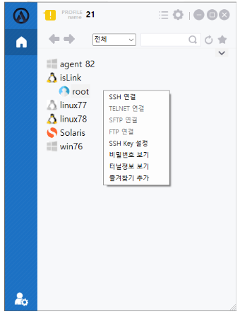
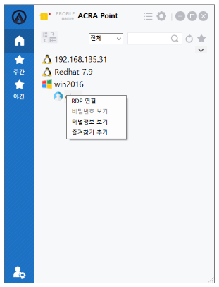
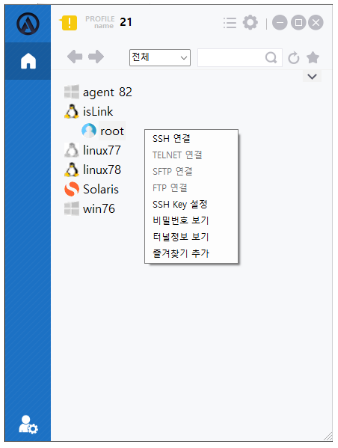
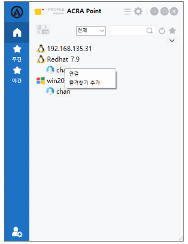

import Table from '/src/util/Table'
import {WindowNodeAccount, LinuxNodeAccount, ComplexNodeAccount} from '/src/constant/NodeAccounts' 

## 계정 메뉴
해당 메뉴는 사용자가 계정에 마우스 우클릭 했을때 나타나는 메뉴이다.  
운영체제에 따라 접근 가능한 서버로 `연결`, `비밀번호 보기`, `터널 정보 보기`, `즐겨찾기 추가/삭제` 기능을 제공한다.

- ACRA Point 관리콘솔에 설정된 프로토콜에 따라 해당 우클릭 연결 메뉴 활성화/비활성화가 결정된다.

## 윈도우 노드 계정

<Table tableData={WindowNodeAccount}/>

:::tip[팁]
[7.4 계정 페이지](http://localhost:3000/docs/자원/7.4%20계정)에서 노드의 비밀번호를 지정하는 기능을 제공하고 있다.
:::

:::info[정보]
`ACRA Point`에 해당 계정에 대한 비밀번호가 저장돼있고, 정책에 `비밀번호 보기`가 `활성화`되어 있을 경우에만 `비밀번호 보기`가 가능하다
:::

:::note[참고]
즐겨찾기 추가  
기본 화면의 계정 우클릭 => 즐겨찾기 추가 => 그룹명 선택 => **추가** 버튼 클릭

즐겨찾기 삭제  
즐겨찾기 화면의 계정 우클릭 => 즐겨찾기 삭제
:::

## 리눅스 노드 계정

<Table tableData={LinuxNodeAccount}/>

:::tip[팁]
[7.4 계정 페이지](http://localhost:3000/docs/자원/7.4%20계정)에서 노드의 비밀번호를 지정하는 기능을 제공하고 있다.
:::

:::info[정보]
`ACRA Point`에 해당 계정에 대한 비밀번호가 저장돼있고, 정책에 `비밀번호 보기`가 `활성화`되어 있을 경우에만 `비밀번호 보기`가 가능하다
:::

:::note[참고]
즐겨찾기 추가  
기본 화면의 계정 우클릭 => 즐겨찾기 추가 => 그룹명 선택 => **추가** 버튼 클릭

즐겨찾기 삭제  
즐겨찾기 화면의 계정 우클릭 => 즐겨찾기 삭제
:::

## 혼합 노드 계정
컨트롤(Ctrl)을 눌러 노드를 두개 이상 선택했을 경우, 우클릭을 하면 나오는 메뉴이다.

<Table tableData={ComplexNodeAccount}/>

:::note[참고]
즐겨찾기 추가  
기본 화면의 계정 우클릭 => 즐겨찾기 추가 => 그룹명 선택 => **추가** 버튼 클릭

즐겨찾기 삭제  
즐겨찾기 화면의 계정 우클릭 => 즐겨찾기 삭제
:::