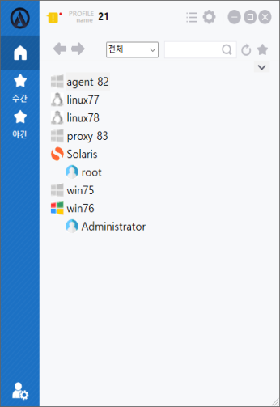
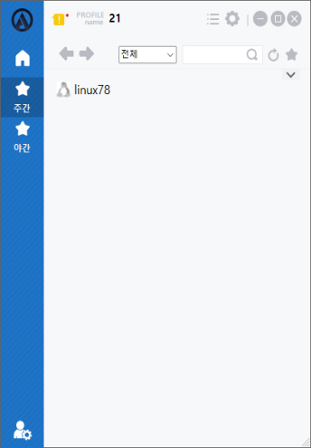
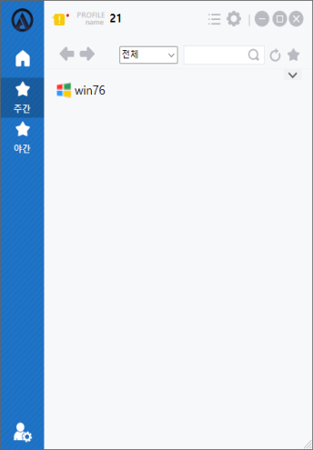
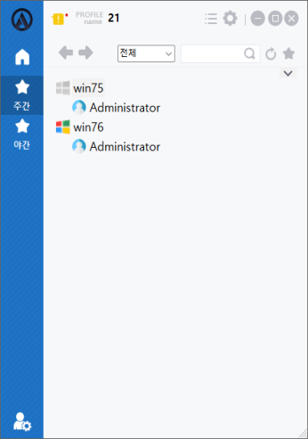
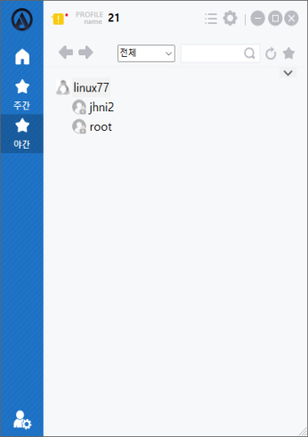
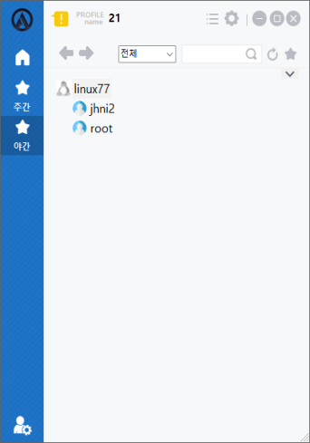

## 노드 및 계정 상태
노드 계정 상태에 따라 다른 UI를 제공해준다.

## 오프라인 노드
OS 아이콘이 흑백으로 표시가 되며, ACRA Point 서버와 연결이 끊어져 있는 상태이다.

## 온라인 노드
OS 아이콘이 컬러로 표시가 되며, ACRA Point 서버와 연결되어 있는 상태이다.

## 현재 시간에 접속이 불가능한 노드
계정명이 회색 텍스트로 표시되며, 접속이 불가능 하다.

## 현재 시간에 접속이 가능한 노드
계정명이 검정색 텍스트로 표시되며, 접속이 가능하다.

## 접속 가능한 프로토콜이 없는 계정
접속 가능한 프로토콜이 없는 경우 계정 아이콘이 사용자 잠금(회색) 아이콘이며 해당 계정에 접속이 불가능 하다.

## 접속 가능한 프로토콜이 있는 계정
접속 가능한 프로토콜이 하나라도 존재하는 경우 계정 아이콘은 컬러로 표시되며 해당 계정에 접속이 가능하다.

