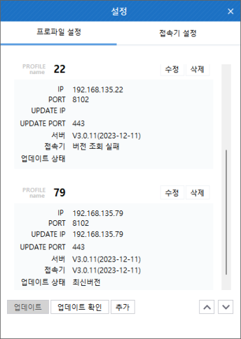

import DownSvg from '/static/img/down.svg';
import UpSvg from '/static/img/up.svg';

## 프로파일 설정
프로파일 명, 서버 주소, 업데이트 서버 주소, 포트, 업데이트 포트, 서버 버전, 접속기 버전, 업데이트 상태 정보를 확인할 수 있다.

- 해당 프로파일을 선택하여 업데이트 확인하거나 업데이트하는 기능을 제공한다.
- 프로파일에 대한 위치 이동, 추가, 수정, 삭제 기능을 제공한다.
- 프로파일 수정 시 서버 연결 테스트 기능을 제공한다.

## 프로파일 추가
프로파일 명, 서버주소, 업데이트 서버 주소, 포트, 업데이트 포트를 입력하여 새로운 ACRA Point 관리서버를 프로파일을 등록하는 기능을 제공한다. 

### 연결 테스트
실제 ACRA Point 관리서버와 연결이 되는지 테스트를 진행할 수 있다.

- 연결 테스트 결과에 따라 연결 성공, 연결 실패 문구를 표시한다.

 

:::info[정보]
프로파일명에 특수문자 입력 불가, 중복 프로파일명 추가 불가, 중복된 서버주소 추가 불가능 하다.
:::

## 프로파일 수정
프로파일에 대한 정보를 수정하기 위한 것으로 프로파일 수정 기능을 제공한다.  
원하는 프로파일을 선택하여 **수정** 버튼을 누르면 해당 정보를 수정할 수 있다.
 

## 프로파일 삭제
해당 메뉴는 프로파일에 대한 정보를 삭제하기 위한 것으로 프로파일 삭제 기능을 제공한다.  
원하는 프로파일을 선택하여 **삭제** 버튼을 누르면 해당 정보를 삭제할 수 있다. 

## 프로파일 순서 이동
해당 메뉴는 즐겨찾기 순서를 이동하기 위한 것으로 <DownSvg/><UpSvg/> (이하 순서 이동) 버튼을 통해 즐겨찾기 순서를 변경하는 기능을 제공한다.
순서를 이동하고자 하는 즐겨찾기 명을 체크한 후 순서 이동 버튼을 누르면 순서가 이동된다. 

:::info[정보]
즐겨찾기 순서이동은 한번에 하나씩 이동할 수 있다.
:::

## 업데이트
해당 메뉴는 접속기의 업데이트를 하기 위한 것으로 업데이트 기능을 제공한다.  
또한 업데이트 중 실패했을 경우 복구 기능을 제공한다.

:::info[정보]
업데이트는 현재 실행중인 접속기 버전과 배포날짜가 높아야 가능하다.
:::

## 업데이트 확인
해당 메뉴는 프로파일에 등록된 ACRA Point 관리서버에 있는 접속기 버전을 확인 하기 위한 것으로 각 프로파일에 대한 서버 버전과 서버에 업로드된 접속기 버전 정보를 조회기능을 제공한다.

:::info[정보]
프로그램 실행시 최초 1회 자동으로 업데이트 확인을 하며, 업데이트 확인중에는 업데이트 확인 버튼이 비활성화 된다.
:::