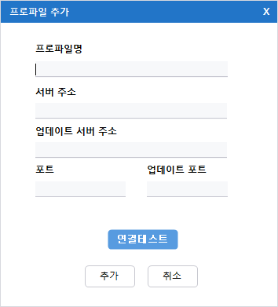

“프로파일 명”, “서버주소”, “업데이트 서버 주소”, “포트”, “업데이트 포트”를 입력하여 새로운 ACRA Point 관리서버를 프로파일을 등록하는 기능을 제공한다. 

- **서버 정보를 입력하고 “연결테스트” 버튼을 통해 실제 ACRA Point 관리서버와 연결이 되는지 테스트를 진행할 수 있다.**
- **프로파일명에 특수문자 입력 불가, 중복 프로파일명 추가 불가, 중복된 서버주소 추가 불가능 하다.**
