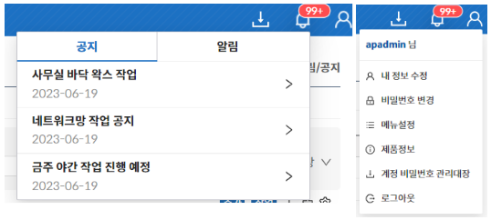

import Tabs from '@theme/Tabs';
import TabItem from '@theme/TabItem';
import Numbering from '/src/util/Numbering';
import Table from '/src/util/Table';
import CommonFeatures from '/src/constant/CommonFeatures';

### 헤더

<Tabs>
  <TabItem value="공지 / 알림" label="공지 / 알림" default>

공지 / 알림을 확인할 수 있는 기능

:::info[정보]
가장 최근에 수신된 공지와 알림 순으로 정렬된다.
:::

  </TabItem>
  <TabItem value="내 정보" label="내 정보">
    아래와 같은 기능들을 사용할 수 있다.
    <Table tableData={CommonFeatures}/>
    
    :::note[참고]
수정 가능한 항목에 대해서는 [7.1 관리자페이지](/docs/자원/7.1%20관리자)를 참고한다.
:::
  </TabItem>
</Tabs>

### 토글 기능

<Numbering num={1} des="왼쪽 사이드바를 숨겨서 화면을 확장할 때 사용하는 기능." />
<Numbering num={1} des="토글 버튼을 클릭하면, 왼쪽 사이드바가 사라짐, 한 번 더 클릭하면 나타난다." />

### 공통 버튼 설명

공통적으로 사용하는 버튼을 정리하여 기술한다.

<Numbering num={1} des="추가: 해당 페이지의 추가 기능 (페이지에 따라 유무 여부가 다름)" />
<Numbering num={2} des="작업: 해당 페이지에서 수행 가능한 작업 리스트" />
<Numbering num={3} des="엑셀 다운로드 버튼을 클릭하여 해당 페이지의 데이터를 엑셀로 다운로드" />
<Numbering num={4} des="필터초기화 버튼을 클릭하여 프론트 필터 초기화" />
<Numbering num={5} des="설정 버튼을 클릭하여 해당 페이지의 컬럼 설정" />

### 조회 기능

<Numbering num={1} des="Input 항목: 해당 페이지에서 서버 조회 가능한 항목들" />
<Numbering num={2} des="초기화: 조회 필터 내용 초기화" />
<Numbering num={3} des="조회: 해당 필터 내용으로 서버 조회" />
<Numbering num={4} des="확장: 접혀있는 항목들 펼치기 기능" />

### 컨텍스트메뉴 작업 기능

공통적으로 사용하는 테이블의 컨텍스트 메뉴 (우클릭) 리스트 구성을 설명한다.

<Numbering num={1} des="첫번째 메뉴는 항상 우클릭한 대상의 이름 혹은 아이디이다." />
<Numbering num={2} des="상세보기 메뉴는 우클릭한 대상 정보를 상세보기 또는 수정할 수 있는 항목이다." />
<Numbering num={3} des="나머지 메뉴는 우클릭한 대상에 대한 작업을 위한 항목이다." />

:::warning[주의]
입력 가능한 모든 창은 500자로 제한한다.
:::
