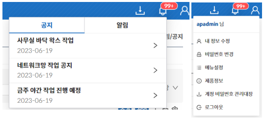

  
1. 알림 / 공지사항 확인 기능
2. 내 정보 수정, 비밀번호 변경, 제품정보, 로그아웃 기능
    - 정보 수정: 로그인한 관리자의 정보를 수정할 수 있는 기능
    - 비밀번호 변경: 로그인한 관리자의 비밀번호를 변경할 수 있는 기능
    - 메뉴설정: 왼쪽 사이드바에 표시할 메뉴를 변경할 수 있는 기능
    - 제품정보: 라이선스 등록 기능 및 제품버전, 라이선스 정보, 확인할 수 있는 가능
    - 계정 비밀번호 관리대장: 계정 비밀번호 관리대장의 열람 권한이 있는 관리자의 경우, 계정 비밀번호 관리대장을 다운로드 받을 수 있는 기능
    - 로그아웃: 로그인한 관리자 로그아웃  

:::danger[주의]

수정 가능한 항목에 대해서는 [7.1 관리자페이지](https://docs.google.com/document/d/140mY80e3aVCp4Pl0yDEuKcY92PUetVyPsJWWcamAQdo/edit#heading=h.8mvl8p2x6f3b)를 참고한다. 

:::