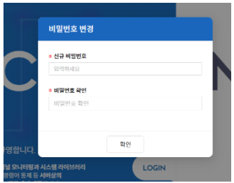

import Numbering from '/src/util/Numbering';

### 관리자 보안관리 인터페이스 접근

<Numbering num={1} des="관리자 URL: https//<ACRA Point가 설치된 서버의 IP> 입력" />
<Numbering num={2} des="ACRA Point 로그인 페이지 확인" />

:::info[정보]
- 보안 관리 인터페이스 접근을 위해 지원하는 브라우저는 릴리즈노트를 확인한다.
- 관리 콘솔을 사용하기 위한 최적 해상도는 1920 X 1080을 권장한다.
- 제약 사항: User ID는 한글 사용이 불가하다.
:::

### 로그인 수행
아이디와 패스워드를 입력하여 로그인을 수행한다.  

**※ 강제 패스워드 변경이 필요하지 않은 경우**

<Numbering num={1} des="User ID: 로그인 ID 입력" />
<Numbering num={2} des="Password: 패스워드 입력" />
<Numbering num={3} des="Login 버튼 클릭 또는 Enter" />

:::warning[주의]
- 제품에 최초로 접속 시, 비밀번호 변경을 위한 화면이 표시 되며 반드시 비밀번호 변경 작업을 수행 해야 한다.
- 로그인 5회 실패 시 사용자의 계정은 잠기므로 주의한다.
- User ID, Pasword를 입력하지 않고, 로그인 버튼만 클릭 시 빨간 테두리가 생성된다.
:::

### 강제 패스워드 변경

**※ 최초 접속 혹은 관리자에 의해 특정 사용자의 패스워드 강제변경이 필요한 경우**

<Numbering num={1} des="신규 비밀번호: 패스워드 입력" />
<Numbering num={2} des="비밀번호확인: 패스워드 재입력" />
<Numbering num={3} des="확인 클릭" />

:::warning[주의]
- 최초 접속이 아닌 강제패스워드 변경일 경우 이전 패스워드 사용 불가하다.
- 비밀번호 확인 불일치 시 빨간 테두리 및 안내 문구가 노출된다.
:::

### 토큰 로그인 수행
정책-클라이언트-관리자에서 토큰체크가 설정된 경우 로그인 시 토큰 페이지로 진입한다.

<Numbering num={1} des="토큰 입력" />
<Numbering num={2} des="엔터 혹은 버튼 클릭시 로그인 진행" />

:::info[정보]
- 토큰의 타입이 모바일 토큰인 경우에는 타이머 및 재요청 버튼이 나타나지 않는다.
- 토큰의 타입이 고정토큰이어도 고정토큰수명이 0(무제한)인 경우에는 타이머 및 재요청 버튼이 나타나지 않는다.
- 토큰 요청 시 ‘토큰 요청’ 버튼은 비활성화 되고 남은 시간이 최초시간의 절반 이하가 됐을 때 활성화 된다.
:::
