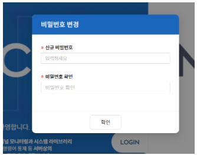

**※최초 접속 혹은 관리자에 의해 특정 사용자의 패스워드 강제변경이 필요한 경우**
1. 신규 비밀번호: 패스워드 입력
2. 비밀번호확인: 패스워드 재입력
3. 확인 클릭
4. 최초 로그인 후 메인화면은 대시보드-차트 화면이다.

|주의|
|---|
|- 최초 접속이 아닌 강제패스워드 변경일 경우 이전 패스워드 사용 불가|
|- 비밀번호 확인 불일치시 빨간 테두리 및 안내 문구 노출|

