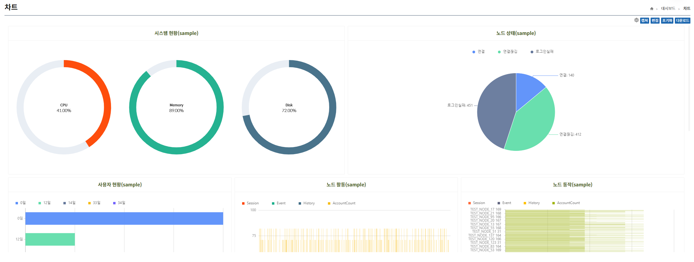
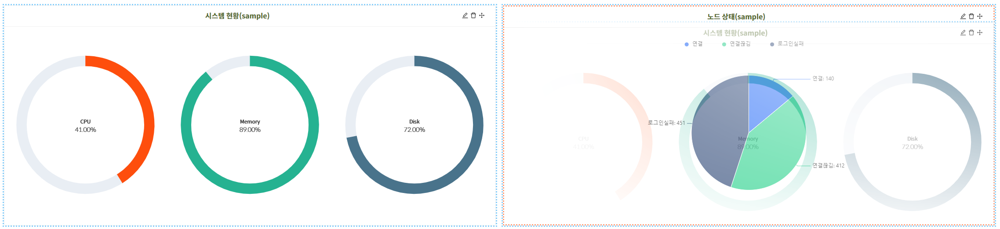

import Table from '/src/util/Table';
import AddingChart from '/src/constant/AddingChart';
import EditSvg from '/static/img/edit.svg'
import DeleteSvg from '/static/img/delete.svg'
import MoveSvg from '/static/img/move.svg'

## 차트
차트 페이지는 관리자가 설정한 차트 화면을 보여준다.

## 상단 메뉴

### 설정

**설정** 버튼은 차트 갱신 주기를 변경할 수 있는 기능이다.

### 캡쳐

**캡쳐** 버튼은 차트를 캡쳐하여 다운로드 할 수 있는 기능으로 요소 선택, 데이터 영역의 항목을 가진다.

:::info[정보]

캡쳐 기능

- 요소 선택: Dom 요소 선택하여 캡쳐
- 데이터 영역: 차트 영역 전체 캡쳐
- ESC 키를 사용해 캡쳐 취소
  :::

### 편집

**편집** 버튼은 차트를 편집하는 기능으로 클릭 시 차트 영역이 편집할 수 있는 상태로 변경된다.

:::note[참고]

편집 버튼 클릭 시

- **차트 추가** 버튼이 생성된다.
- **편집** 버튼은 **완료** 버튼으로 변경된다.
- 이후 편집 모드라고 지칭한다.
  :::

### 초기화

**초기화** 버튼은 관리자가 설정한 차트들을 모두 제거하는 기능이다.

:::note[참고]

초기화 버튼 클릭 시

- **초기화 하시겠습니까?** 알림 창이 뜬다.
- **확인** 버튼을 클릭 시 차트가 초기화된다.
- **취소** 버튼을 클릭 시 차트 초기화가 취소된다.
  :::

:::warning[주의]
차트 초기화 시 설정된 차트가 모두 사라지므로 주의해야 한다.
:::

### 다운로드

**다운로드** 버튼은 해당 차트들을 다운로드 할 수 있는 기능이며 다운로드를 지원하는 확장자는 다음과 같다.

- Excel
- PDF

## 편집 모드

**편집** 버튼을 클릭하여 편집 모드 진입이 가능하며 차트 위치 이동 및 삭제 차트 내용 편집을 지원한다.  
편집 모드 진입 시 상단 버튼은 차트 **추가**, **닫기**, **완료**, **다운로드** 버튼이 노출된다.

### 차트 이동

차트 이동은 편집 모드 상태에서 나타나는 <MoveSvg/> 아이콘을 드래그하여 가능하다.

:::info[정보]

- 이동 아이콘을 드래그하면 대상 차트가 함께 이동하며, 목표 차트 위에 올라갈 시 테두리가 빨간색으로 바뀌며 Drop 가능한 상태가 된다.
- 드래그를 종료하면 대상 차트와 목표 차트의 위치가 바뀌게 된다.  
  (크기는 각자 차트 자신의 크기를 유지한다.)
  :::

### 차트 편집

편집 모드에서 <EditSvg/> 버튼을 클릭하여 차트 편집이 가능하며, 편집 화면은 차트 추가 화면과 동일하다.

### 차트 삭제

편집 모드에서 <DeleteSvg/> 버튼을 클릭하여 차트 삭제가 가능하다.

### 편집 저장

편집 모드에서 **완료** 버튼을 누르면 즉시 저장된다.  
편집 모드에서 **닫기** 버튼은 취소의 의미로, 변경된 차트가 저장되지 않는다.

## 차트 추가

**편집** 버튼을 클릭하여 편집 모드 진입 시 **차트 추가** 버튼이 노출되며, 클릭 시 차트를 추가할 수 있는 모달이 노출된다.

### 추가할 차트 정보

<Table tableData={AddingChart} />

:::info[정보]

- 차트를 추가할 때 데이터 종류, 노드 그룹 선택, 차트 종류는 필수값이다.
- 데이터 종류에 따라 선택할 수 있는 차트 종류가 변경된다.
- 선택한 노드 그룹 내의 노드들을 대상으로 차트를 구성한다.  
  (사용자 관련 데이터인 경우에는 사용자 역할을 대상으로 차트를 구성한다.)
  :::
