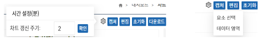
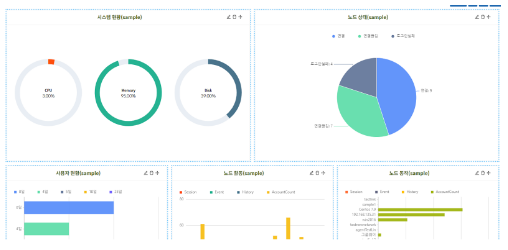

**“설정”** 버튼은 차트 갱신 주기를 변경할 수 있는 기능이다.

**“캡쳐”** 버튼은 차트를 캡쳐하여 다운로드 할 수 있는 기능으로 “요소 선택”, “데이터 영역”의 항목을 가진다.
- 요소 선택: Dom 요소 선택하여 캡쳐
- 데이터 영역: 차트 영역 전체 캡쳐
- ESC 키를 사용해 캡쳐 취소

**“편집”** 버튼은 차트를 편집하는 기능으로 클릭 시 차트 영역이 편집할 수 있는 상태로 바뀌고 버튼 영역에 “차트 추가” 버튼이 생성되고 “편집” 버튼은 “완료” 버튼으로 바뀐다. (이후 편집 모드라고 지칭)

**“초기화”** 버튼은 관리자가 설정한 차트들을 모두 제거하는 기능이다.

**“다운로드”** 버튼은 해당 차트들을 다운로드 할 수 있는 기능으로 Excel과 PDF 다운로드를 지원한다.