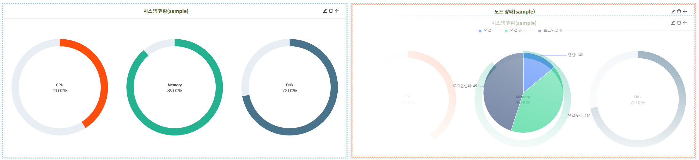

차트 편집은 상단의 편집 버튼을 클릭하여 편집 모드 진입 시 가능하며 차트 위치 이동 및 삭제 차트 내용 편집을 지원한다.
편집모드 진입 시 상단 버튼은 “차트 추가”, “닫기”, “완료”, “다운로드”의 버튼이 노출된다.

**&#45; 차트 이동**

차트 이동은 편집 모드 상태에서 나타나는  아이콘을 드래그하여 가능하다.  
해당 아이콘을 드래그하면 대상 차트가 함께 끌리게 되며, 목표 차트 위에 올라갈 시 테두리가 빨간색으로 바뀌며 Drop 가능한 상태가 된다.  
이후 드래그를 종료하면 대상 차트와 목표 차트와의 위치가 바뀌게 된다.  
(크기는 각자 차트 자신의 크기를 유지한다.)

**&#45; 차트 편집**  
편집모드에서  버튼을 클릭하여 차트 편집이 가능하며, 편집 화면은 추가 화면과 동일.

**&#45; 차트 삭제**  
편집모드에서  버튼을 클릭하여 차트 삭제가 가능.

**&#45; 편집 저장**  
차트의 경우 차트 편집화면에서 확인을 누르면 즉시 변경.  
차트 위치의 경우 편집모드 상태에서 상단의 “완료” 버튼 클릭 시 저장됨.  
**“닫기”** 버튼은 취소의 의미로 이동된 차트의 위치가 저장되지 않는다.