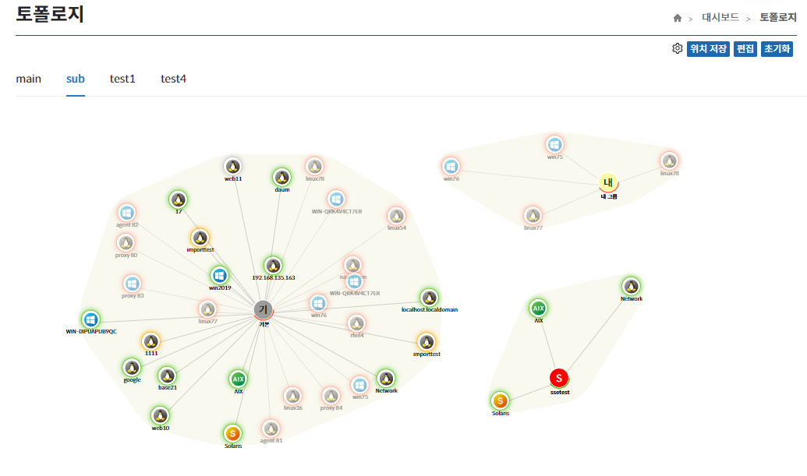

토폴로지에 그려진 아이콘들은 드래그를 통한 위치 이동 및 휠 동작을 통한 스케일 변경이 가능하다.

동일 그룹내의 노드들은 배경에 같은 영역을 통해 알 수 있으며 그룹과의 연결을 통해 해당 그룹에 속해 있음을 한 눈에 알 수 있다.

&#45; **“설정”** 버튼은 격자 표시, 센터 표시를 변경할 수 있는 기능이다.  
&#45; **“위치 저장”** 버튼은 관리자가 조정한 위치 및 스케일을 저장하는 기능을 제공한다.  
&#45; **“초기화”** 버튼은 저장된 위치를 초기화 하는 기능을 제공한다.  

- **위치가 저장되지 않은 경우에 토폴로지 내 이미지들의 첫 위치는 랜덤하게 지정된다.**  
- **dim 처리된 노드는 연결이 끊긴 상태의 노드이다.**
