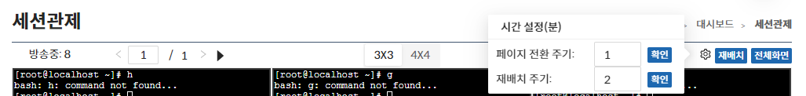
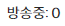
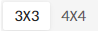
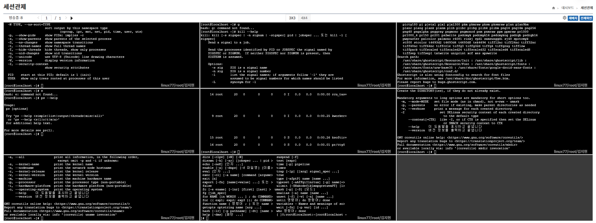
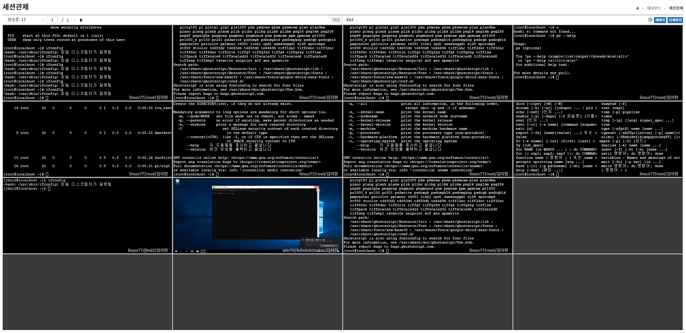
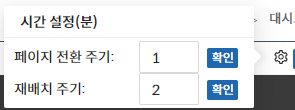

## 세션 관제
세션 관제 페이지는 보안관리 인터페이스의 관리대상에 현재 접속중인 세션을 다중 모니터링 할 수 있는 화면으로 동시에 9개 or 16개의 세션을 모니터링 할 수 있다.

- 가장 최근에 실행한 세션이 상단에 위치한다.

:::info[정보]
방송중인 세션에서 금지 이벤트 발생시 빨간 테두리의 알림이 발생한다.
:::

## 상단 메뉴
방송 카운트와 페이지네이션, 자동 페이지 전환 버튼, 개수 변경, 주기 변경, 재배치, 전체 화면을 제공한다.

### 방송카운트
현재 방송중인 세션의 개수와 종료된 방송의 개수를 나타낸다.

:::info[정보]
종료된 방송의 경우 페이지 진입 이후 종료된 카운트를 나타내며 페이지 재진입 시 리셋된다.
:::

### 페이지네이션

방송의 개수가 많은 경우 페이지네이션을 통해 제공되며 수동 or 자동 페이지 전환된다.

### 자동 페이지 전환 버튼

클릭시 페이지 전환이 설정된 시간에 맞춰 자동 전환되며, 재 클릭시 페이지 전환되지 않는다.

### 개수 변경
기본은 `3x3` 으로 총 9개의 방송이 노출되고 `4x4` 의 기능도 제공되어 선택 가능하다.

#### 3x3 방송 화면

#### 4x4 방송 화면

### 주기 변경
자동 페이지 전환 설정시 전환될 페이지 전환 주기 및 재배치 주기를 설정할 수 있다.

### 재배치
종료된 방송이 있는 경우 해당 위치는 블랙화면으로 표시되며 수동 혹은 자동 재배치 되면 방송화면이 재 정렬된다.

### 전체화면

전체 화면 클릭 시 방송 영역이 전체 화면으로 표시 된다.  

