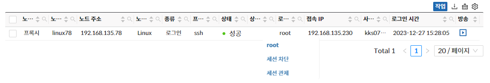
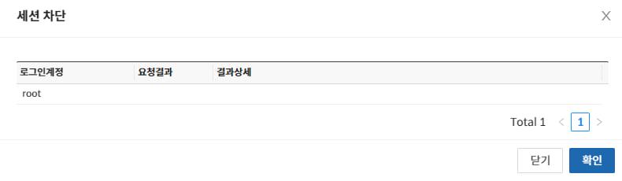
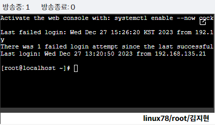
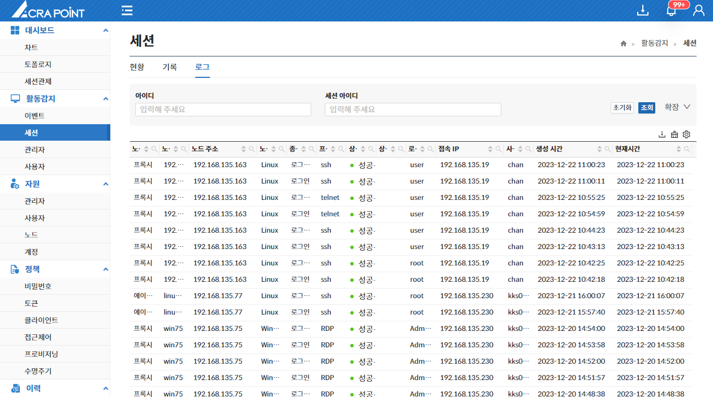
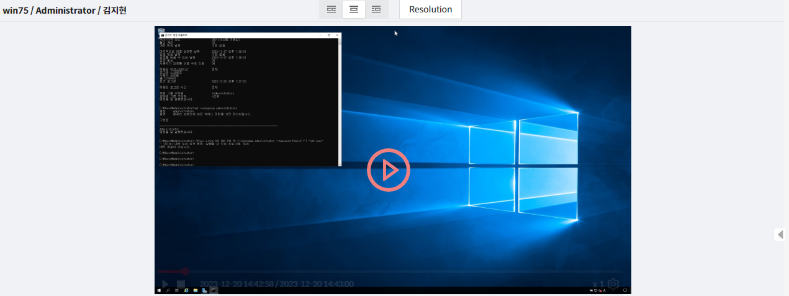
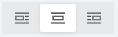
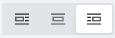
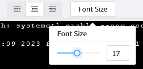
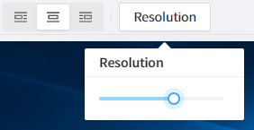

import Tabs from '@theme/Tabs';
import TabItem from '@theme/TabItem';
import Numbering from '/src/util/Numbering';

## 현황
세션 현황 페이지는 보안관리 인터페이스의 관리대상장비에 접속하고 있는 사용자들의 현황을 보기 위한 것으로 세션 차단, 세션 관제 기능을 제공한다.

### 세션 차단 및 세션 관제

<Tabs>
  <TabItem value="세션 차단" label="세션 차단" default>
  
세션을 차단할 수 있는 두가지 방법

  1. 원하는 세션의 **Context Menu**(우클릭)에서 세션을 차단할 수 있다.
  2. 원하는 세션을 선택해 **작업** 버튼을 클릭하여 세션을 차단할 수 있다.

  

  
세션 차단 시 팝업창 노출

  

    세션 차단 시 팝업창이 뜨고 **확인** 버튼 클릭 시 세션 차단이 요청된다.  

  
  

  </TabItem>
  <TabItem value="세션 관제" label="세션 관제">
  
세션을 관제할 수 있는 두가지 방법

  1. 원하는 세션의 **Context Menu**(우클릭)에서 세션 관제가 가능하다.
  2. 원하는 세션을 선택해 **작업** 버튼을 클릭하여 세션 관제가 가능하다.  

  

  :::info[정보]
    세션 관제를 클릭하면 라이브 방송 화면으로 이동되며 방송화면에 대한 내용은 [6.2.4 방송페이지](http://localhost:3000/docs/활동감지/6.2%20세션/6.2.4%20방송%20페이지/)에 서술한다.
  :::
  </TabItem>
</Tabs>

## 기록
세션 기록 페이지는 보안관리 인터페이스의 관리대상장비에 접속했던 사용자들의 기록을 보기 위한 것으로 접속기록 조회, 접속 기록 보기, 세션 관제 기능을 제공한다.

:::note[참고]
세션을 관제할 수 있는 두가지 방법  
위 세션 현황에서의 [세션 관제](#세션-차단-및-세션-관제)와 동일하다.
:::

## 로그
세션 로그 페이지는 보안관리 인터페이스의 관리대상장비에 접속했던 사용자들의 로그를 보기 위한 것으로 세션 로그의 기록을 제공한다.

## 방송
방송 페이지는 보안관리 인터페이스의 대상관리 장비에 접속했던 세션들의 행위를 실시간 또는 녹화된 화면을 볼 수 있는 페이지다.  

:::info[정보]
방송 페이지는 세션관제, 이벤트, 세션현황, 세션기록 페이지를 통해 진입 가능하다.
:::

  

<Tabs>
  <TabItem value="상단 메뉴" label="상단 메뉴">
    

      <Numbering num={1} des='상단 좌측'/>
      접속중인 노드 이름, 로그인 계정, 사용자 이름이 노출된다.  

      <Numbering num={2} des='상단 중앙'/>
      - **위치 이동**  
        좌측, 중앙, 우측 정렬  

          

      - **Font Size 조절(SSH 터미널의 경우)**  
        드래그 바를 사용해 폰Font Size 조절을 할 수 있다.
        
        

      - **해상도 조절(RDP의 경우)**   
        드래그 바를 사용해 해상도 조절을 할 수 있다.

        
    

  </TabItem>

  <TabItem value="방송 화면" label="방송 화면">
  방송 플레이어는 녹화방송인 경우 시작, 정지, 배속 (x1, x2, x4, x8), Progress Bar 점프 기능을 제공하고 실시간인 경우에는 기본 방송과 금지 이벤트 알림이 제공된다. 

  </TabItem>

  <TabItem value="이벤트 리스트" label="이벤트 리스트">
  이벤트 리스트는 녹화방송인 경우에만 제공되며 페이지모드, 스크롤 모드로 전환이 가능하다.  
해당 이벤트 클릭 시 해당 이벤트의 시점으로 이동된다.

  </TabItem>  
</Tabs>
