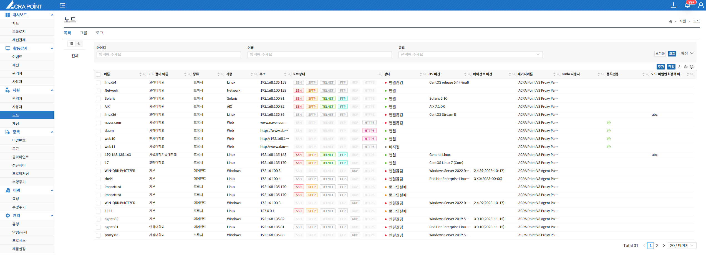
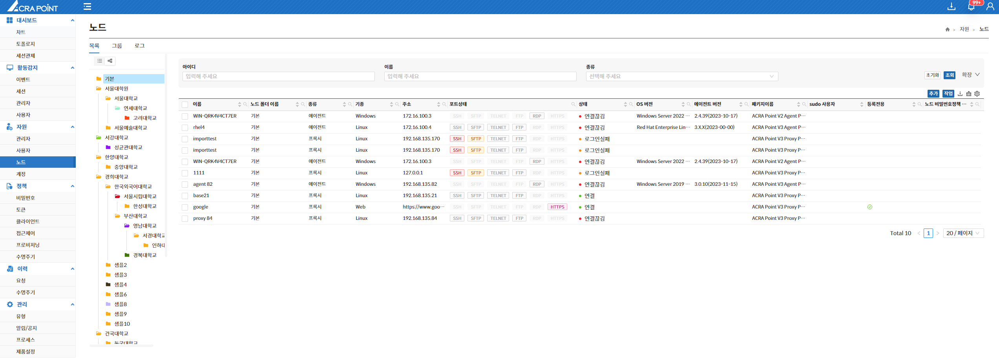

최상위관리역할 관리자는 모든 메뉴에 대한 정보를 제공받으며, 모든 노드에 대하여 읽고 쓸 수 있는 권한을 가진다.

  
< Tree View >

  
< Folder View >

- **최상위관리역할 관리자는 노드 폴더의 관리자를 지정할 수 있다.**
- **최상위관리역할 관리자는 모든 노드에 대한 노드 폴더를 확인할 수 있다.**
- **최상위관리역할 관리자는 모든 노드에 대한 계정 비밀번호 관리대장을 열람할 수 있다.**
