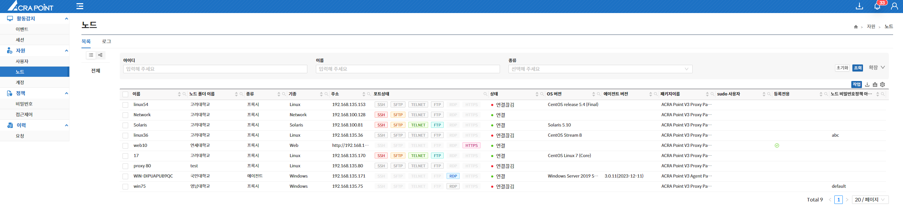

중간관리역할 관리자는 허락된 특정 메뉴에 대한 정보를 제공받으며, 권한이 할당된 노드에 대하여 읽고 쓸 수 있는 권한을 가진다.

  
< Tree View >

  
< Folder View >

- **중간관리역할 관리자는 권한이 할당된 노드에 대한 이벤트, 세션, 사용자, 노드, 계정, 접근제어 사용자, 접근제어 역할을 확인할 수 있다.**  
- **중간관리역할 관리자는 전체 노드의 비밀번호 노드 정책과 접근제어 룰셋을 확인할 수 있다.**  
- **중간관리역할 관리자는 관리자 자신이 요청한 이력을 확인할 수 있다.**  
- **중간관리역할 관리자는 권한이 할당된 노드에 대한 노드 폴더만 확인할 수 있다.**  
- **중간관리역할 관리자는 권한이 할당된 노드에 대한 계정 비밀번호 관리대장을 열람할 수 있다.**  

