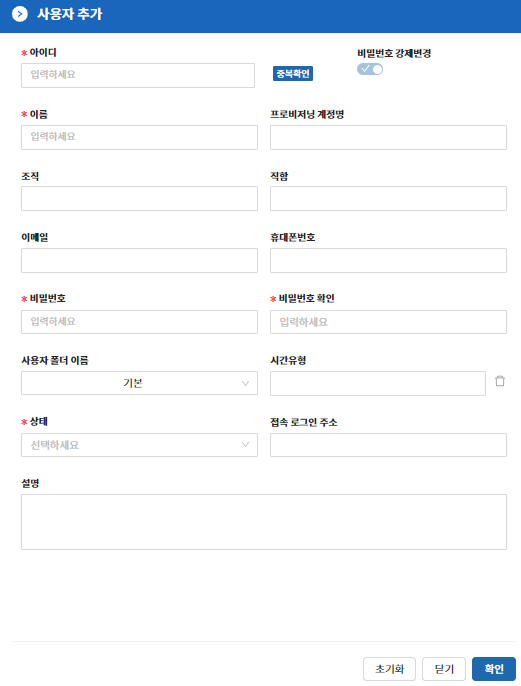

목록 탭은 보안관리 인터페이스에서 ACRA Point 관리서버에 등록된 사용자를 보기 위한 것으로 List View와 Folder View를 지원하며, 상세보기, 사용자 삭제, 비밀번호 변경, 폴더 지정, 역할 보기, 접근 가능한 계정 보기, 접속 로그인 주소 지정, 잠금 및 잠금 해제, 모바일토큰 발급 및 삭제, 고정토큰 발급 및 삭제, 로그인 시간유형 지정 및 지정 해제 기능을 제공한다.

&#45; **사용자 추가**  
**“추가”** 버튼은 사용자를 추가할 수 있는 기능으로 아이디, 이름, 비밀번호, 비밀번호 확인, 상태를 필수적으로 입력하고 조직, 직함, 이메일, 휴대폰번호, 사용자 폴더 이름, 시간유형, 접속 로그인 주소를 선택적으로 입력할 수 있다.

- **아이디는 중복으로 사용할 수 없다.**

  
< List View >

  
< Folder View >

&#45; **폴더의 생성 / 수정 / 삭제**  
폴더의 생성 / 수정 / 삭제는 기본적으로 폴더영역에서 우클릭을 통해 동작 가능하다.

- **폴더를 우클릭하여 생성하는 경우 해당 폴더의 하위 폴더가 생성된다.**  
- **폴더 영역의 빈공간을 우클릭하여 생성하는 경우 root path의 폴더가 생성된다.**  
- **폴더의 수정은 폴더명 수정과 색상 수정 메뉴로 나뉘어 있다.**  
- **폴더를 삭제한 경우 해당 폴더에 속한 사용자는 기본 폴더로 이동된다.**  
- **상위 폴더를 삭제한 경우 하위 폴더도 함께 삭제된다.**  
- **기본 폴더는 삭제가 불가능하다.**  
 
&#45; **폴더에 사용자 지정**  
폴더에 사용자를 지정하는 것은 세 가지의 방법이 있다.

- **Context Menu의 폴더 지정을 통해 한 명의 사용자를 원하는 폴더에 넣을 수 있다.**  
- **사용자를 드래그하여 목표 폴더에 드랍하는 것으로 한 명의 사용자를 원하는 폴더에 넣을 수 있다.**  
- **사용자들을 체크하여 작업 메뉴의 폴더 지정을 통해 한명 or 다중 사용자를 원하는 폴더에 넣을 수 있다.**  
